# 03 — High-Level Architecture

## 1. Nguyên tắc thiết kế (Architectural Principles)

1. **Domain-Driven Design (DDD)**: Hệ thống được chia theo bounded context của domain học tập, không theo technical layer. Mỗi context = 1 team + 1 hoặc nhóm microservices.
2. **Microservices vừa đủ**: Không over-split. Bắt đầu với ~15 services cho Phase 1, tăng dần theo nhu cầu. Tránh "microservice hell".
3. **API-First**: Mọi chức năng public qua API có hợp đồng rõ ràng (OpenAPI 3.1 / GraphQL SDL / Protobuf). Frontend, mobile, partner cùng dùng chung API layer.
4. **Event-Driven cho decoupling**: Các tác vụ không đồng bộ (analytics, notification, enrichment content, audit log, gamification) đi qua Kafka. Mỗi service emit domain events.
5. **OmniLingo persistence**: Chọn DB phù hợp từng workload thay vì ép tất cả vào một database.
6. **Stateless services**: Mọi service HTTP đều stateless, state sống ở DB/cache. Scale ngang bằng cách thêm pod.
7. **Cloud-agnostic đến mức hợp lý**: Core không bị lock in AWS/GCP sâu, chỉ bind cloud provider ở infrastructure layer (S3 → ObjectStorage abstraction).
8. **Security by default**: Zero trust giữa các service (mTLS trong cluster), secret management qua Vault/KMS, least-privilege IAM.
9. **Observability is not optional**: Structured logging, metrics, distributed tracing từ ngày đầu. Không "thêm sau".
10. **Cost-aware**: AI inference (LLM, Whisper, TTS) là chi phí lớn nhất — phải có layer caching, rate limit, và fallback tier.

## 2. Kiến trúc cấp logic (Logical Architecture)

Hệ thống chia thành **7 lớp**:

```
┌─────────────────────────────────────────────────────────────┐
│  1. CLIENT LAYER                                            │
│  Web (Next.js) | iOS (Swift) | Android (Kotlin) | React    │
│  Native cross-platform | Desktop (Electron wrapper)         │
└─────────────────────────────────────────────────────────────┘
           │               │                │
           ▼               ▼                ▼
┌─────────────────────────────────────────────────────────────┐
│  2. EDGE LAYER                                              │
│  CDN (Cloudflare) | WAF | DDoS | Edge workers              │
│  (static, audio, video, image caching)                      │
└─────────────────────────────────────────────────────────────┘
           │
           ▼
┌─────────────────────────────────────────────────────────────┐
│  3. API GATEWAY / BFF LAYER                                 │
│  Kong/Envoy gateway (auth, rate limit, routing)             │
│  BFF per client (web-bff, mobile-bff) aggregate GraphQL     │
└─────────────────────────────────────────────────────────────┘
           │
           ▼
┌─────────────────────────────────────────────────────────────┐
│  4. DOMAIN SERVICES LAYER (microservices)                   │
│  Learning | Content | Assessment | Speech-AI | Tutor | …   │
│  (chi tiết xem 04-microservices-breakdown.md)               │
└─────────────────────────────────────────────────────────────┘
       │        │        │                        │
       ▼        ▼        ▼                        ▼
┌──────────┐ ┌──────┐ ┌──────────┐       ┌──────────────┐
│ 5. DATA  │ │ 5a.  │ │ 5b. AI   │       │ 5c. 3rd-Party│
│ STORAGE  │ │ CACHE│ │ PROVIDERS│       │ INTEGRATIONS │
│ PG, Mongo│ │Redis │ │OpenAI,   │       │ Stripe, IAP, │
│ CH, ES,S3│ │      │ │Anthropic,│       │ Apple/Google,│
│          │ │      │ │ElevenLabs│       │ VNPay, SSO   │
└──────────┘ └──────┘ └──────────┘       └──────────────┘
       │
       ▼
┌─────────────────────────────────────────────────────────────┐
│  6. MESSAGING / EVENT BACKBONE                              │
│  Kafka (event bus) | RabbitMQ (task queue)                  │
│  Schema Registry (Avro/Protobuf)                            │
└─────────────────────────────────────────────────────────────┘
           │
           ▼
┌─────────────────────────────────────────────────────────────┐
│  7. ANALYTICS & ML PLATFORM                                 │
│  Data lake (S3) | Warehouse (ClickHouse/BigQuery)           │
│  Airflow/Dagster ETL | Feature store | ML training (k8s +  │
│  GPU) | Model registry                                      │
└─────────────────────────────────────────────────────────────┘
```

## 3. Sơ đồ kiến trúc tổng (Mermaid)

```mermaid
flowchart TB
    subgraph Clients
        Web[Web App<br/>Next.js]
        iOS[iOS App<br/>Swift/SwiftUI]
        Android[Android App<br/>Kotlin/Compose]
        RN[Cross-platform<br/>React Native]
    end

    subgraph Edge
        CDN[Cloudflare CDN + WAF]
    end

    subgraph Gateway
        APIGW[API Gateway<br/>Kong / Envoy]
        WebBFF[Web BFF]
        MobileBFF[Mobile BFF]
    end

    subgraph CoreServices[Core Domain Services]
        Identity[identity-service]
        Learning[learning-service]
        Content[content-service]
        Vocab[vocabulary-service]
        Grammar[grammar-service]
        SRS[srs-service]
        Assess[assessment-service]
        Progress[progress-service]
        Gamif[gamification-service]
        Social[social-service]
        Tutor[tutor-service]
        Booking[booking-service]
        Classroom[classroom-service]
        Billing[billing-service]
        Entitle[entitlement-service]
        Notif[notification-service]
        Search[search-service]
    end

    subgraph AIServices[AI Services]
        SpeechAI[speech-ai-service<br/>STT/TTS/pronunciation]
        WritingAI[writing-ai-service<br/>grading/feedback]
        AITutor[ai-tutor-service<br/>chat/voice roleplay]
        LLMGateway[llm-gateway<br/>routing/cache/budget]
    end

    subgraph Support
        Media[media-service<br/>upload/transcode]
        Dict[dictionary-service]
        Mod[moderation-service]
        Proctor[proctoring-service]
        Video[video-service<br/>WebRTC SFU]
    end

    subgraph Data
        PG[(PostgreSQL<br/>OLTP)]
        Mongo[(MongoDB<br/>Content)]
        Redis[(Redis<br/>cache/leaderboard)]
        ES[(Elasticsearch<br/>search)]
        CH[(ClickHouse<br/>analytics)]
        S3[(S3 Object Storage<br/>media)]
        Vector[(Vector DB<br/>pgvector/Qdrant)]
    end

    subgraph Messaging
        Kafka[Apache Kafka]
        Queue[RabbitMQ<br/>task queue]
    end

    subgraph External
        OpenAI[OpenAI API]
        Anthropic[Anthropic Claude]
        Whisper[Whisper self-host]
        Eleven[ElevenLabs TTS]
        Azure[Azure Speech]
        Stripe[Stripe]
        VNPay[VNPay/MoMo]
        IAP[Apple/Google IAP]
    end

    Web --> CDN
    iOS --> CDN
    Android --> CDN
    RN --> CDN
    CDN --> APIGW
    APIGW --> WebBFF
    APIGW --> MobileBFF
    WebBFF --> Identity & Learning & Content & Progress & Search
    MobileBFF --> Identity & Learning & Content & Progress & Search

    Learning --> Vocab & Grammar & SRS
    Learning --> Assess
    Vocab --> Dict
    Assess --> WritingAI & SpeechAI
    AITutor --> LLMGateway & SpeechAI
    LLMGateway --> OpenAI & Anthropic
    SpeechAI --> Whisper & Eleven & Azure
    Tutor --> Booking
    Booking --> Video
    Classroom --> Video
    Billing --> Stripe & VNPay & IAP
    Billing --> Entitle
    Social --> Mod

    Identity --> PG
    Learning --> PG
    Vocab --> PG & Redis
    SRS --> PG & Redis
    Content --> Mongo & S3
    Assess --> PG & Mongo
    Progress --> PG & CH
    Gamif --> Redis & PG
    Social --> PG & Mod
    Search --> ES
    Media --> S3
    AITutor --> Vector & Redis

    Learning & Assess & Progress & Gamif & Social & Billing --> Kafka
    Kafka --> CH
    Notif -.consumes.-> Kafka
    Queue --> Media & SpeechAI & WritingAI
```



## 4. Tương tác client ↔ backend

### 4.1. Backend For Frontend (BFF) Pattern

Ta **không** expose hàng chục microservice trực tiếp cho client, vì 3 lý do:
- Giảm chattiness (mobile gọi nhiều API tốn battery).
- Tránh hiệu ứng domino khi đổi service contract.
- Có chỗ để aggregate data và optimize cho từng client type.

**Hai BFF:**
- `web-bff` (Node.js + GraphQL): phục vụ web app, aggregate rộng vì web có nhiều màn hình dashboard.
- `mobile-bff` (Node.js + GraphQL): tối ưu payload nhỏ, cache-friendly, hỗ trợ `@defer` để streaming partial results.

Cả hai gọi xuống internal services qua gRPC.

### 4.2. GraphQL vs REST vs gRPC

| Layer | Giao thức | Lý do |
|-------|-----------|-------|
| Client ↔ BFF | GraphQL | Flexible cho màn hình phức tạp, giảm round trip, frontend tự chọn field |
| BFF ↔ internal services | gRPC | Hiệu năng cao, type-safe qua protobuf |
| Internal service ↔ service | gRPC hoặc Kafka | gRPC cho sync RPC, Kafka cho async event |
| Public API (cho partner, B2B) | REST (OpenAPI) | Chuẩn thị trường, dễ tích hợp |
| Realtime (chat tutor, live class) | WebSocket hoặc WebRTC | Native realtime |

### 4.3. Authentication flow (tóm tắt)

- Access token = JWT (RS256) TTL 15 phút.
- Refresh token TTL 30 ngày, stored httpOnly cookie (web) hoặc secure storage (mobile).
- Identity service là source of truth; các service khác verify JWT cục bộ bằng JWKS.
- Social login: Google, Apple, Facebook, Zalo (VN market).

Chi tiết ở [09-security-and-compliance.md](./09-security-and-compliance.md).

## 5. Request lifecycle ví dụ

**Người dùng làm 1 bài dictation:**

1. Client gọi `GET /lessons/{id}` → qua CDN (nếu cached) hoặc qua API Gateway → Mobile BFF.
2. Mobile BFF gọi gRPC `learning-service.GetLesson(id)` lấy metadata và danh sách exercises.
3. Mobile BFF gọi `content-service.GetAudio(lessonId)` → trả về URL ký sẵn (signed URL) tới S3/CDN cho audio.
4. Client stream audio từ CDN trực tiếp, không qua BFF (giảm băng thông BFF).
5. Người dùng gõ câu → client gọi `POST /exercises/{id}/submit` → Mobile BFF → `assessment-service.GradeExercise()`.
6. assessment-service tính đúng/sai, emit event `learning.exercise.completed` lên Kafka.
7. Consumers (song song):
   - `progress-service` cập nhật XP, skill score.
   - `srs-service` tính lại interval cho từ vựng liên quan.
   - `gamification-service` cấp XP, cập nhật league.
   - `analytics-pipeline` (ClickHouse) lưu event để phân tích cohort.
   - `notification-service` check streak nếu cần push reminder.

## 6. Triển khai đa vùng (Multi-Region)

Năm 1: single region (Singapore AWS `ap-southeast-1`) do user chủ yếu châu Á.

Năm 2+: mở rộng:
- `us-east-1` cho US/Canada users.
- `eu-west-1` cho EU (GDPR — data residency).
- Strategy: **region-local writes** cho user data; content (static, media) replicate global qua CDN.
- DB cross-region: PostgreSQL logical replication hoặc chuyển sang Aurora Global / CockroachDB cho một số workload (entitlement, catalog) khi traffic yêu cầu.

## 7. Capacity & scale targets

Mục tiêu năm 1 (cuối năm):
- 150k MAU, 45k DAU, peak concurrent 6k.
- ~1,500 req/s peak ở BFF layer.
- AI calls: ~500 concurrent conversations, 30k pronunciation checks/giờ lúc peak.
- Media egress: ~2 TB/ngày.

Mục tiêu năm 3:
- 3M MAU, peak concurrent 120k, ~30k req/s peak.

Mỗi service phải có load test scenario tương ứng trước khi promote production.

## 8. Design decisions — lý do chọn (ADR summary)

Các quyết định quan trọng có ADR (Architecture Decision Record) riêng lưu trong `/docs/adr/`. Ví dụ:

| ADR | Quyết định | Tóm tắt lý do |
|-----|-----------|---------------|
| ADR-001 | Chọn microservices thay vì modular monolith | Team dự kiến 40+ người năm 2, nhiều domain độc lập, workload AI rất khác với CRUD |
| ADR-002 | Kafka làm event backbone | Throughput cao, ecosystem mạnh, partition theo userId đảm bảo ordering |
| ADR-003 | PostgreSQL làm DB chính | Quen thuộc, JSON support, pgvector cho embedding, tránh NoSQL hype |
| ADR-004 | ClickHouse cho analytics thay BigQuery | Self-host rẻ hơn ở scale kỳ vọng, realtime query tốt, multi-cloud |
| ADR-005 | Self-host Whisper thay vì dùng OpenAI API | Cost: tiết kiệm 70% ở scale dự kiến, latency thấp hơn |
| ADR-006 | BFF pattern + GraphQL | Giảm chattiness cho mobile, tách biệt client contract |
| ADR-007 | FSRS thay cho SM-2 | Accuracy tốt hơn, research gần đây cho thấy retention cao hơn ~15% |
| ADR-008 | React Native cho mobile | Chia sẻ code cho iOS/Android, team nhỏ, hiệu năng đủ với Hermes + Reanimated |

## 9. Những gì sơ đồ này KHÔNG thể hiện

- **Chi tiết từng service**: xem [04](./04-microservices-breakdown.md).
- **Schema DB**: xem [05](./05-data-model.md).
- **CI/CD pipeline, k8s**: xem [08](./08-infrastructure-and-deployment.md).
- **Observability stack** (Prometheus, Grafana, Loki, Tempo): xem [12](./12-observability-and-sre.md).
- **Feature flag + experimentation (Unleash/Growthbook)**: xem [08](./08-infrastructure-and-deployment.md).
