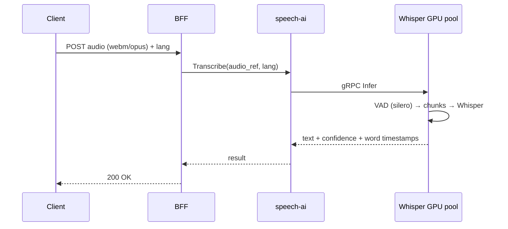

# 07 — AI & ML Services

AI là trái tim của trải nghiệm OmniLingo Academy. Tài liệu này mô tả chi tiết các service AI, model được dùng, pipeline, chi phí ước tính, và hướng tiến hoá.

## 1. Tổng quan AI workload

| Chức năng | Model / Provider | Mode | Latency target | Chi phí dự kiến |
|-----------|------------------|------|----------------|-----------------|
| Speech-to-text (batch) | Whisper large-v3 (self-host GPU) | Server | < 2s cho 10s audio | ~$0.0005/phút |
| Speech-to-text (realtime streaming) | faster-whisper + VAD | Server GPU | < 300ms chunk | ~$0.001/phút |
| Pronunciation scoring | Azure Speech (Pronunciation Assessment) → phase 2: custom | SaaS → self | < 1s | $0.006/câu |
| Text-to-speech (standard) | Azure TTS / Amazon Polly neural | SaaS | < 500ms TTFB | $16/1M char |
| Text-to-speech (premium) | ElevenLabs (flash/turbo) | SaaS | < 200ms TTFB | $0.30/1K char |
| Writing grading / feedback | Claude Sonnet 4 / GPT-4o | SaaS | 3–8s | $3–15/1M tokens |
| AI chat tutor (text) | Claude Haiku / GPT-4o-mini cho free; Sonnet/Opus cho premium | SaaS | 1–3s | $0.25–15/1M tokens |
| AI voice tutor (realtime) | LLM streaming + TTS streaming | SaaS | < 800ms end-to-end | ~$0.15/phút conversation |
| Embedding (search, RAG) | text-embedding-3-large hoặc multilingual-e5 (self-host) | Self-host | batch | Near-zero ở scale |
| Content moderation | OpenAI Moderation + custom BERT | Mixed | < 300ms | Free/low |
| Image moderation | AWS Rekognition / Hive | SaaS | < 500ms | $1/1K images |
| Proctoring (face/gaze) | MediaPipe + custom rules | Self-host CPU | < 1s | Low |
| Adaptive learning (IRT / CAT) | Custom model | Self | < 50ms | Near-zero |
| SRS algorithm (FSRS) | rs-fsrs | Self (CPU) | < 10ms | Near-zero |
| Handwriting recognition | ML Kit Digital Ink (on-device) / TrOCR fallback | Client / Server | < 500ms | Free |

## 2. speech-ai-service

### 2.1. STT — Transcription

**Đường đi request**:



**Self-host Whisper setup:**
- Model: `whisper-large-v3` (1.55B params). Chạy trên GPU `g5.xlarge` (A10G 24GB) hoặc `g6.xlarge` (L4).
- Dùng **faster-whisper** (CTranslate2 backend, int8 quantization) — nhanh hơn Whisper gốc 4x.
- Batch size dynamic, autoscale pod theo queue depth.
- Mỗi pod handle ~50–80 concurrent requests, p50 latency 1.2s cho 10s audio.

**Khi nào dùng SaaS (Azure/Deepgram):**
- Ngôn ngữ Whisper yếu (tiếng Việt, tiếng Thái — Deepgram Nova tốt hơn).
- Spike traffic quá capacity.
- Real-time yêu cầu < 150ms latency — Deepgram streaming xuất sắc.

**Config per-language routing:**
```yaml
stt_routing:
  en: whisper-self-host
  ja: whisper-self-host
  zh: whisper-self-host
  ko: whisper-self-host
  vi: deepgram-nova
  th: deepgram-nova
```

### 2.2. TTS — Synthesis

**Caching là then chốt**: nhiều câu thoại trong lesson/exercise/AI tutor được dùng lại. Cache theo key `hash(text + voice + lang + speed)`. Hit rate mục tiêu > 60% ở steady state.

**Tiered provider** theo gói user:
- Free/Plus → Azure Neural TTS (đủ tốt, $16/1M char).
- Pro → ElevenLabs Flash (chất lượng cao, latency < 200ms TTFB).
- Ultimate + AI voice tutor realtime → ElevenLabs Turbo với streaming.

**Voice catalog**: 4–8 giọng mỗi ngôn ngữ, nam/nữ, vùng miền (Anh Mỹ/Anh Anh/Úc; Tokyo/Kansai; Mandarin chuẩn/Cantonese…).

### 2.3. Pronunciation assessment

Giai đoạn 1 — dùng **Azure Speech Pronunciation Assessment**:
- Input: audio + reference text + language.
- Output: accuracy score, fluency, completeness, và **per-phoneme score** (key differentiator).
- Ưu: ready to use, chất lượng đã validated thị trường.
- Nhược: chi phí cao ở scale, không customize được.

Giai đoạn 2 — train model riêng:
- Data flywheel: thu thập audio + reference + native audio + điểm từ Azure → dùng làm training signal.
- Model: wav2vec 2.0 hoặc whisper-based với phoneme-level CTC.
- Khi data đủ lớn (> 100k utterances per language), self-host chất lượng có thể sánh với Azure.

**Phoneme-level feedback UI**: hiển thị IPA, tô đỏ âm sai, play lại audio chỉ phần lỗi.

## 3. writing-ai-service

### 3.1. Chấm essay (IELTS, TOEFL, HSK)

**Prompt pattern** (đơn giản hoá):
```
System: You are an IELTS examiner. Assess the following essay strictly
against the official rubric: Task Response, Coherence & Cohesion,
Lexical Resource, Grammatical Range & Accuracy.

For each criterion give: band score (0..9), rationale (<=80 words),
and top 3 specific sentence-level issues with suggested fixes.

Output strictly as JSON matching schema: {...}

Essay prompt: {prompt}
Student essay: {essay}
Target band: {target}
```

**Rubric structured output** → render UI feedback.

**Validation**: kiểm tra JSON schema; nếu model trả về invalid (hiếm), retry với `response_format: json_object`.

**Calibration**: So sánh band score AI với band score thật từ kỳ thi (user submit feedback sau khi có kết quả) — tính MAE. Mục tiêu MAE < 0.5 band.

**Chi phí kiểm soát**:
- Prompt caching (Claude): cache phần "system + rubric" (cùng nhau ~2k tokens) → chỉ pay cho essay mới.
- Essay dài trung bình 250 từ ≈ 350 tokens; input + output ~3k tokens/request → chi phí < $0.02/essay với Claude Sonnet.

### 3.2. Correction từng câu (journal mode)

Model nhẹ hơn (Haiku/GPT-4o-mini). Prompt:
```
Correct the following sentence written by a {level} learner of {language}.
Output JSON: {"corrected": "...", "diffs": [...], "grammar_points": ["..."]}
```

`grammar_points` là danh sách keyword → mapping về grammar DB để link "Learn about this" button.

## 4. ai-tutor-service

### 4.1. Chat tutor (text)

**Architecture**:

```
Client WS ↔ ai-tutor-service
              │
              ├── Session state (Redis)
              ├── User context (learning-service, progress-service)
              ├── Content retrieval (Vector DB — embedding của lessons, grammar, user cards)
              └── LLM gateway → Claude/GPT
```

**Context building** khi mỗi message:
1. Fetch last N messages từ Redis conversation history.
2. Retrieve relevant lessons/grammar points từ vector DB (top-k nearest tới user query).
3. Include user's learning profile (level, goal, UI language).
4. Build prompt với adaptive system message theo level:
   - Beginner → "Use simple vocabulary, short sentences".
   - Advanced → "Engage naturally, correct only significant errors".

**Safety**:
- Moderation layer trước khi gửi LLM (output too).
- Redact PII từ conversation log trước khi lưu analytic.

### 4.2. Voice tutor (realtime)

**Pipeline streaming** (mục tiêu e2e latency < 800ms):

```
Mic → WebRTC → Server
   ↓
VAD (silero) phát hiện end of utterance
   ↓
faster-whisper (chunked) → text đầy đủ
   ↓
LLM streaming (Claude Sonnet streaming API)
   ↓ (token-by-token)
Sentence detector
   ↓ (complete sentence)
ElevenLabs Turbo TTS (input streaming)
   ↓ (audio chunk)
WebRTC → Speaker
```

Cắt streaming theo câu: khi LLM trả về token `.`/`!`/`?`/`。`/`！`, flush phần đã có sang TTS. Giảm latency perceived.

**Interruption handling**: nếu user bắt đầu nói trong khi AI đang nói, cancel current TTS stream, restart pipeline.

**Tiếng Việt**: hỗ trợ user dùng tiếng mẹ đẻ hỏi, tutor trả lời ngôn ngữ đích (tuỳ mode). Code-switching quan trọng cho beginner.

### 4.3. Roleplay scenarios

Library 500+ scenarios (ordered by level, topic). Mỗi scenario có:
```json
{
  "id": "en_b1_hotel_checkin",
  "language": "en",
  "level": "B1",
  "topic": "travel",
  "persona": "You are a hotel receptionist at a 4-star hotel in London. Be professional and helpful.",
  "initial_message": "Good evening, welcome to the Savoy. How may I help you?",
  "vocab_targets": ["reservation", "check-in", "key card", "breakfast included"],
  "success_criteria": ["check in", "ask about amenities", "complete the task in <10 exchanges"]
}
```

Sau buổi chat, AI tutor evaluator đánh giá success + grammar + vocab use.

## 5. llm-gateway

### 5.1. Trách nhiệm & features

1. **Provider routing**: map request type → provider → model. Config:
```yaml
routes:
  writing.grade.essay:
    primary: anthropic/claude-sonnet-4
    fallback: openai/gpt-4o
  tutor.chat.free_tier:
    primary: anthropic/claude-haiku-4
    fallback: openai/gpt-4o-mini
  tutor.chat.premium_tier:
    primary: anthropic/claude-sonnet-4
```

2. **Caching**:
   - **Exact cache**: hash(provider+model+messages) → response. Áp dụng cho prompt deterministic.
   - **Semantic cache**: embedding của query, nếu similarity > threshold với cache entry, reuse. Dùng Qdrant. Áp dụng cho câu hỏi kiến thức (grammar explanation), không dùng cho personalized response.

3. **Budget & rate limit**:
   - Per-user: Free tier = 10 chat tutor msgs/ngày, Plus = 50, Pro = unlimited.
   - Per-tenant (B2B): monthly token cap.
   - Enforcement: Redis counter + deny khi exceeded.

4. **PII redaction**: regex email/phone/credit-card trước khi gửi LLM provider (doesn't hit their logs).

5. **Observability**:
   - Log mọi call với: user_id, route, provider, input_tokens, output_tokens, latency, cost_estimate.
   - Export sang ClickHouse → dashboard chi phí theo ngày/feature/user segment.

6. **Prompt registry**: mọi prompt lưu trong Git (`/prompts/*.yaml`), có version, sync vào llm-gateway via API. Prompt A/B test được (variant flag).

### 5.2. Cost optimization

Đây là SLO lớn — AI cost không được > 25% revenue. Các đòn bẩy:

| Kỹ thuật | Impact |
|----------|--------|
| Semantic cache (RAG trả lời factual) | -20–40% gọi LLM |
| Prompt cache (Anthropic/OpenAI prompt caching) | -50% input token cost cho static prefix |
| Model tiering (Haiku cho free, Sonnet cho pro) | -70% cost/request free tier |
| Streaming TTS, LLM (giảm retry timeout) | -10% cost |
| Batch request khi có thể (writing grading batch 5 essay) | -20% overhead |
| Self-host Whisper (thay OpenAI STT) | -70% STT cost |
| TTS output cache | -60% TTS cost |

## 6. Adaptive Learning Engine

Không phải "service" riêng độc lập mà là logic nằm ở `learning-service` + `progress-service` + một model ML.

### 6.1. Mô hình

Dùng **Item Response Theory (IRT) / Computerized Adaptive Testing (CAT)** cho assessment:
- Mỗi exercise có difficulty parameter `b`.
- Mỗi user có ability estimate `θ` per skill.
- Sau mỗi câu trả lời, Bayesian update `θ`.
- Chọn câu tiếp theo để tối đa hoá information gain (câu có difficulty gần ability hiện tại).

**Benefit**: diagnostic test cần ít câu hơn (15 câu → ước lượng tốt như 40 câu tuyến tính).

### 6.2. Lesson recommendation

**Multi-armed bandit** với context (CMAB):
- Arms: các lesson/exercise có thể gợi ý.
- Reward: retention + completion rate + user rating.
- Context: user level, goal, thời gian trong ngày, session length trước đây.
- Model: Thompson sampling với linear model (vowpal wabbit hoặc custom PyTorch).

Tại cold start (user mới): dùng rule-based dựa trên diagnostic test.

### 6.3. Weak area detection

Mỗi skill có mô hình sub-score (grammar point, phoneme, vocabulary topic). Theo dõi moving average → khi xuống dưới threshold, tự động sinh "remediation pack" các bài tập về điểm yếu đó.

## 7. Content Generation (AI-assisted)

AI không chỉ phục vụ user runtime mà còn tăng tốc sản xuất content:

- **Example sentence generation**: cho mỗi từ mới, prompt LLM sinh 10 ví dụ ở 3 level, editor duyệt/chỉnh.
- **Distractor generation**: cho multiple choice, LLM sinh các đáp án sai plausible.
- **Translation & adaptation**: dịch lesson content sang ngôn ngữ UI khác; biên tập viên review.
- **Image gen**: illustration cho flashcard dùng Stability AI, filter kỹ, editor duyệt.

**Guardrails**: KHÔNG xuất bản content AI sinh ra mà không có human review. AI là "trợ lý sản xuất" chứ không phải replace editor.

## 8. Vector DB layout

Collections (Qdrant) / tables (pgvector):

| Collection | Purpose | Dim | Distance |
|-----------|---------|-----|----------|
| `content_chunks` | Lesson/grammar chunks cho RAG tutor | 1024 (multilingual-e5-large) | cosine |
| `user_notes` | Ghi chú cá nhân user (để tutor nhớ) | 1024 | cosine |
| `semantic_cache_llm` | LLM response semantic cache | 1024 | cosine |
| `question_similarity` | Tìm câu hỏi tương tự cho recommendation | 768 | cosine |

Embedding được compute offline (batch) cho content, online cho user query.

## 9. On-device AI (client)

Một số tác vụ chạy trên thiết bị để giảm latency và cost:

- **Voice Activity Detection**: `silero-vad` WASM (web), native (mobile).
- **Handwriting recognition**: Google ML Kit Digital Ink (Android, miễn phí), Apple PencilKit (iOS).
- **On-device speech for privacy** (optional, future): WhisperKit trên iOS, small Whisper trên Android với ONNX.

## 10. Responsible AI & evaluation

### 10.1. Evaluation harness

Mỗi feature AI có test suite:
- **Writing grading**: 200 essay đã được chấm thủ công bởi IELTS examiner certified, chạy mỗi lần đổi prompt hoặc model. Metrics: MAE band, agreement rate.
- **Chat tutor**: golden dataset 500 conversation, tự động check structural (JSON valid), human spot-check 5% weekly.
- **Pronunciation**: so sánh với Azure baseline trên 1,000 audio sample.
- **Moderation**: recall trên toxic dataset, precision trên benign dataset.

Dashboard eval metrics theo thời gian — regression alert khi metric giảm.

### 10.2. User trust

- UI nói rõ "AI-generated feedback" khi có.
- Cho phép user report sai — feedback này vào queue human review, trở thành training data.
- Không dùng AI cho quyết định high-stakes không thể kháng cáo (ví dụ: cert pass/fail → chỉ làm "practice", luôn recommend kỳ thi thật).

### 10.3. Bias & fairness

- Test STT/pronunciation trên nhiều accent (non-native speakers từ nhiều nước khác nhau).
- Review prompt không có bias văn hoá/giới tính ẩn.
- Voice catalog đa dạng vùng miền.

## 11. Data flywheel

Theo thời gian, dữ liệu user giúp cải thiện model:

1. Opt-in user contributions (anonymized) → training set.
2. Feedback loop: user rating essay grading → signal tinh chỉnh rubric.
3. Ahn pronunciation samples → train custom pronunciation model.
4. SRS history → tinh chỉnh FSRS parameters per user / per language cohort.
5. Lesson completion patterns → cải thiện recommendation bandit.

Mọi pipeline này phải tôn trọng privacy (xem [09](./09-security-and-compliance.md)).
