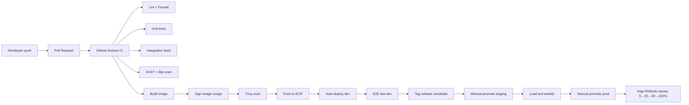

# 08 — Infrastructure & Deployment

Tài liệu này mô tả cách OmniLingo Academy được build, ship và run. Mọi kiến trúc ứng dụng ở [03](./03-high-level-architecture.md) và danh sách service ở [04](./04-microservices-breakdown.md) đều chạy trên hạ tầng mô tả dưới đây.

## 1. Cloud strategy

### 1.1. Lựa chọn cloud provider

**Primary: AWS (`ap-southeast-1` Singapore)** cho Year 1.

| Tiêu chí | AWS | GCP | Azure |
|---------|-----|-----|-------|
| Region gần VN | Singapore (~30ms) | Singapore / Tokyo | Singapore |
| Managed K8s | EKS (trưởng thành) | GKE (tốt nhất DX) | AKS |
| AI/ML | Bedrock, SageMaker | Vertex AI mạnh | Azure OpenAI tốt |
| Data services | RDS/Aurora, DynamoDB, S3 | Spanner, BigQuery | Cosmos, Synapse |
| Giá | Baseline | ~10% rẻ hơn | Tương đương AWS |
| Hệ sinh thái VN | Đối tác/hỗ trợ tốt | Đối tác ít hơn | Đối tác vừa phải |

**Quyết định**: AWS vì ecosystem chín, EKS + RDS + S3 + CloudFront là combo quen thuộc với đa phần engineer, khả năng tuyển người dễ. Azure OpenAI và GCP Vertex vẫn được dùng cho AI workload (xem [07](./07-ai-ml-services.md)) — multi-cloud selective, không phải full multi-cloud.

### 1.2. Region & AZ strategy

**Year 1**: single region `ap-southeast-1`, 3 AZ cho HA.
**Year 2**: thêm `us-east-1` (Bắc Mỹ) và `eu-west-1` (EU) cho compliance GDPR + latency.
**Year 3+**: thêm `ap-northeast-1` (Tokyo) nếu user JP nhiều, `ap-south-1` (Mumbai) cho Ấn Độ.

Active-active multi-region thay vì active-passive để tận dụng tài nguyên và tránh "cold failover" (disaster recovery đã test qua tải thực).

### 1.3. Account structure (AWS Organizations)

```
Root (billing, audit)
├── security-ou
│   ├── audit-account (CloudTrail org trail, Config aggregator)
│   └── log-archive-account (S3 immutable, cross-region)
├── platform-ou
│   ├── network-account (Transit Gateway, Route 53, shared VPC endpoints)
│   └── shared-services-account (CI/CD runners, container registry mirror)
├── workload-ou
│   ├── dev-account
│   ├── staging-account
│   ├── prod-account
│   └── data-account (analytics warehouse, ML training)
└── sandbox-ou
    └── per-engineer-sandbox (auto-expire sau 30 ngày)
```

Mỗi account = security boundary. Compromise 1 account không lan ra cái khác.

## 2. Kubernetes

### 2.1. Cluster topology

**EKS clusters per environment + region**:

| Cluster | Mục đích | Node groups |
|---------|---------|-------------|
| `dev-eks-sg` | Dev + feature branches | 2-10 spot (m6i.large) |
| `staging-eks-sg` | Pre-prod, load test | 3-15 on-demand + spot mix |
| `prod-eks-sg` | Production Singapore | System (on-demand), App (mixed), AI (GPU) |
| `prod-eks-use1` | Production US (Year 2) | Tương tự |

**Node pools** trong prod cluster:

- **system**: 3x m6i.large (on-demand) — chạy ingress, monitoring, cert-manager, karpenter. Không có taint đặc biệt — workload thường cũng chạy được, nhưng ưu tiên system.
- **app-general**: Karpenter auto-scale, mixed m6i/c6i/r6i spot + on-demand. Mặc định 70% spot / 30% on-demand; stateful workload force on-demand.
- **app-compute**: c6i cho worker service (transcoding, image processing).
- **ai-gpu**: g5.xlarge / g5.2xlarge (A10G) cho Whisper self-hosted, VAD, embedding. Scale-to-zero khi không có load.
- **ai-gpu-large**: g5.12xlarge cho LLM self-host (nếu phase 2 chạy in-house model).

Taints: `workload=ai:NoSchedule` cho GPU pool, tránh workload thường ghé thăm.

### 2.2. Karpenter vs Cluster Autoscaler

Dùng **Karpenter** vì:
- Bin-packing tốt hơn, giảm 15-30% cost node so với CA.
- Provisioning nhanh hơn (~30s vs 3-5 phút).
- Khai báo policy bằng CRD (`NodePool`, `EC2NodeClass`) linh hoạt.

Cluster Autoscaler giữ cho legacy scenarios và managed node group của hệ thống.

### 2.3. Namespaces & multi-tenancy

Một namespace cho một bounded context:

```
platform-system       # ingress, cert-manager, external-secrets
observability         # prometheus, loki, tempo, grafana
service-mesh          # linkerd / istio control plane
identity              # identity-service, user-service
learning              # learning-service, srs-service, progress-service
content               # content-service, content-cms, media-service
assessment            # assessment-service, test-prep-service
ai                    # speech-ai, writing-ai, ai-tutor, llm-gateway
tutoring              # tutor-service, booking-service, classroom-service
commerce              # billing-service, subscription-service, marketplace
social                # social-service, leaderboard-service, notification
support               # admin-panel, ops-tools
```

NetworkPolicy mặc định **deny-all**; mỗi namespace khai báo whitelist ingress/egress bằng Cilium/Calico.

### 2.4. Service mesh

**Linkerd** cho Phase 1 (lightweight, mTLS tự động, ít config).
**Istio** cân nhắc ở Phase 2 nếu cần traffic management phức tạp hơn (cross-region routing, rich policy, canary theo header).

Mesh cung cấp:
- mTLS giữa các pod (zero-trust).
- Retry/timeout/circuit-break định nghĩa qua resource mesh.
- Traffic split cho canary/blue-green.
- Golden metrics (success rate, latency, RPS) cho mỗi service-to-service call.

### 2.5. Ingress

**Public ingress**: AWS ALB Controller (ALB tự động tạo từ Ingress/Gateway API). Domain chính `api.omnilingo.academy`, `app.omnilingo.academy`.

**Edge**: Cloudflare trước ALB cho DDoS, WAF, bot management. Không dùng ALB WAF để tránh lock-in.

**Internal**: NGINX Ingress hoặc Gateway API cho traffic nội bộ (admin, ops-tools, metric dashboards).

### 2.6. Storage

**EBS gp3** làm default StorageClass cho stateful workload (Postgres operator, Kafka, Redis).
**EFS** cho shared workspace (hiếm dùng — prefer S3).
**S3** cho media, backup, data lake.

PVC size nhỏ (10-50 GB) cho đa số, các DB lớn (Postgres main) ≥ 500 GB + auto-expand.

## 3. Infrastructure as Code

### 3.1. Stack

- **Terraform (OpenTofu)** cho AWS resource (VPC, EKS, RDS, S3, IAM, Route 53). Module hóa per-service.
- **Helm** cho Kubernetes application manifest. Mỗi service một chart riêng, chuẩn hoá bằng shared library chart.
- **Argo CD** để sync Helm release từ Git → cluster (GitOps).
- **Crossplane** cân nhắc Phase 2 nếu muốn provision AWS resource từ Kubernetes (cho dev self-serve).

### 3.2. Terraform layout

```
infra/
├── modules/                    # reusable
│   ├── vpc/
│   ├── eks/
│   ├── rds-postgres/
│   ├── s3-bucket/
│   └── cloudfront-distribution/
├── live/
│   ├── global/                 # Route 53, IAM org, Organizations
│   ├── sg/                     # ap-southeast-1
│   │   ├── dev/
│   │   ├── staging/
│   │   └── prod/
│   ├── us/                     # Year 2
│   └── eu/                     # Year 2
└── modules.registry/           # internal module registry (Terraform Cloud / GitLab)
```

State backend: S3 + DynamoDB lock, per-environment. Workspace separation.

### 3.3. Drift detection

- `terraform plan` chạy schedule mỗi 2h trên prod, alert nếu có drift.
- AWS Config rules check compliance (encryption, public S3, MFA on root).
- Terraform apply chỉ qua CI — cấm human apply từ laptop.

## 4. CI/CD pipeline

### 4.1. Tổng quan



### 4.2. Branch strategy

**Trunk-based development** với short-lived feature branch:
- `main` luôn deployable. Feature flag gate cho chưa-sẵn-sàng.
- Feature branch sống < 2 ngày, PR nhỏ (<500 LOC changed), merge squash.
- Không có long-running `develop` branch.
- Release bằng tag `v<service>-<semver>` trên main.

### 4.3. GitHub Actions

- Workflow shared qua reusable workflows trong repo `platform/ci-templates`.
- Mỗi service template chuẩn: `lint.yml`, `test.yml`, `build.yml`, `deploy.yml`.
- Self-hosted runners trên EKS (ARC) cho build nhanh + private network access.
- GitHub-hosted runners cho jobs không cần private network.

### 4.4. Container build

- **Distroless** base image cho Go / Java.
- **node:20-alpine** hoặc **bun** cho Node service, multi-stage build.
- **python:3.12-slim** cho Python.
- Image nhỏ (< 200 MB) cho đa số, AI image có thể to (GPU libs).

Tag convention: `<service>:<git-sha>` cho mutable dev, `<service>:<semver>` cho release (immutable).

### 4.5. GitOps deploy với Argo CD

- Mỗi service có thư mục trong `gitops-repo/`:
  ```
  gitops/
    clusters/
      prod-sg/
        identity/
          values.yaml              # base values
          values-overlay.yaml      # prod-specific
          kustomization.yaml
  ```
- CI không `kubectl apply`. CI chỉ update Helm values (image tag) + commit → Argo CD sync.
- Rollback = git revert.
- App-of-apps pattern: parent Argo App quản lý tất cả child Apps.

### 4.6. Deployment strategy

**Argo Rollouts** cho progressive delivery:

- **Canary** default cho service stateless:
  - 5% traffic → wait 10 min + check metrics.
  - 25% → wait 10 min.
  - 50% → wait 15 min.
  - 100%.
  - Analysis template: error rate < 0.1%, p99 latency < baseline * 1.2.
- **Blue-green** cho service stateful (ít dùng) hoặc service có cold-start lâu (AI model load).
- **Recreate** cho worker offline batch (không ảnh hưởng user).

### 4.7. Feature flags

**Unleash** (self-host) hoặc **GrowthBook**:
- Flag types: release toggle, ops toggle (kill switch), experiment (A/B), permission (beta user).
- SDK integrated client (web, mobile) + server.
- Flag lifecycle: owner, expiry date, cleanup task trong Jira.
- "Zombie flag" cleanup weekly (flag đã 100% rollout > 4 tuần → xoá code).

Quan trọng: canary deploy kill được bug infra, feature flag kill được bug code/product. Hai layer khác nhau.

## 5. Networking

### 5.1. VPC design

Mỗi environment-region có 1 VPC dedicated.

```
VPC 10.10.0.0/16 (prod-sg)
├── public-subnet-az1   10.10.0.0/22    (ALB, NAT gateway)
├── public-subnet-az2   10.10.4.0/22
├── public-subnet-az3   10.10.8.0/22
├── private-app-az1     10.10.32.0/20   (EKS node, Lambda, ECS)
├── private-app-az2     10.10.48.0/20
├── private-app-az3     10.10.64.0/20
├── private-data-az1    10.10.128.0/22  (RDS, Redis, ES — no internet)
├── private-data-az2    10.10.132.0/22
└── private-data-az3    10.10.136.0/22
```

- IGW cho public subnet.
- NAT Gateway (1/AZ) cho private-app subnet egress. Hoặc NAT instance nếu cost-sensitive — nhưng prefer NAT GW.
- Private-data subnet không có route ra internet — chỉ VPC endpoint cho S3/DDB.
- VPC endpoints (Gateway): S3, DynamoDB. VPC endpoints (Interface): ECR, Secrets Manager, KMS, STS, SSM.

### 5.2. Cross-account / cross-region

- **Transit Gateway** nối các VPC (dev, staging, prod, shared-services).
- **VPC peering** không dùng (khó scale).
- **Cross-region**: TGW inter-region peering cho DR replication (S3 cross-region, RDS replica).

### 5.3. DNS

- **Route 53** public hosted zone `omnilingo.academy`.
- Private hosted zone `internal.omnilingo.academy` cho service discovery giữa các VPC.
- **External DNS** controller trong EKS auto-create Route 53 record cho Ingress/Service với annotation.
- TTL ngắn (60s) cho record có thể chuyển failover.

### 5.4. Edge / CDN

**Cloudflare** làm edge, lý do:
- Giá tốt cho egress (hoặc unmetered).
- WAF + DDoS + Bot Management tích hợp.
- Workers KV cho rate limit đa vùng.
- Cloudflare R2 lựa chọn phụ cho media (tránh egress S3).

CDN cache strategy:

| Asset | TTL | Purge |
|-------|-----|-------|
| Static (JS/CSS/image có hash) | 1 year | immutable |
| Audio/video media | 30 days | on content update |
| Thumbnail | 7 days | on update |
| API response (GET public) | 60-300s | SWR |
| HTML (Next.js ISR) | 60s revalidate | on publish |

## 6. Environments

| Env | Purpose | Data | Availability |
|-----|---------|------|-------------|
| **local** | Dev máy cá nhân, docker-compose + Tilt | Seed data | N/A |
| **dev** | Preview PR, feature branch deploy | Anonymized staging snapshot | Best-effort |
| **staging** | Pre-prod mirror | Anonymized copy of prod | 99% (business hours) |
| **prod** | Customer-facing | Real | 99.9% (xem SLO [12](./12-observability-and-sre.md)) |
| **sandbox** | Per-engineer | Clean seed | Auto-destroy 30 days |

Staging cần giống prod **về hình dạng hạ tầng** (cùng helm chart, cùng Terraform module) nhưng scale thấp hơn. Dữ liệu giả lập đúng khối lượng cho test perf.

**Preview environment** (dev): mỗi PR tạo namespace ephemeral `pr-<number>`, TTL 72h. Cho phép PM/QA xem feature trước khi merge.

## 7. Secrets & config

- **AWS Secrets Manager** cho secret (DB password, API key, signing key).
- **External Secrets Operator** đồng bộ từ ASM vào Kubernetes Secret.
- **HashiCorp Vault** cân nhắc Phase 2 cho dynamic secret (DB credential rotate mỗi 1h, PKI).
- **Config**: Helm values + ConfigMap; env-specific override.
- **Không commit secret vào git**. Pre-commit hook + truffleHog scan.

## 8. Disaster recovery

### 8.1. Mục tiêu

- **RPO**: 5 phút (data loss tối đa).
- **RTO**: 1 giờ (thời gian khôi phục).

### 8.2. Chiến lược

| Component | Backup | DR strategy |
|-----------|--------|------------|
| Postgres | PITR + daily snapshot, cross-region replica | Promote replica khi region down |
| MongoDB Atlas | Continuous backup | Restore point-in-time |
| Redis | AOF + daily snapshot S3 | Warm standby (accept data loss cache) |
| Elasticsearch | Snapshot S3 hourly | Rebuild from source-of-truth |
| ClickHouse | Snapshot S3 daily | Rebuild |
| S3 media | Versioning + cross-region replication | Automatic |
| Kafka | MirrorMaker 2 → DR cluster | Promote DR cluster |

### 8.3. Game days

Quý 1 lần: team chủ động stress test DR scenarios (region down, DB master loss, Kafka cluster loss). Ghi lại gap, fix.

## 9. Cost management

### 9.1. Lưu ý chính

- **Spot instances** cho stateless workload (tiết kiệm 60-70%). Diversify instance type để giảm risk interrupt.
- **Savings Plans / RI** cho baseline capacity (on-demand + system node).
- **Graviton (ARM)** cho service build được ARM — rẻ hơn 20%. Go/Rust/Node thường ok.
- **S3 Intelligent-Tiering** cho media ít truy cập.
- **Cloudflare R2** thay S3 cho media bucket lớn (egress free).
- **Scheduled scale-down** dev/staging ngoài giờ làm việc.
- **Right-sizing** hàng tháng dựa trên metric (Goldilocks, Vertical Pod Autoscaler recommendation).

### 9.2. Cost allocation

- Tag mọi resource: `service`, `env`, `team`, `cost-center`.
- AWS Cost Explorer + Cost and Usage Report → S3 → ClickHouse → Grafana dashboard "cost per service per day".
- Alert khi daily cost > baseline * 1.3.

### 9.3. Target cost ratio (indicative)

| Danh mục | % doanh thu |
|----------|-------------|
| Compute (EC2/EKS) | 8-12% |
| Database (RDS/Atlas) | 5-8% |
| Storage + CDN | 3-5% |
| AI / LLM / ML | <25% (xem [07](./07-ai-ml-services.md)) |
| Monitoring + tooling | 1-2% |
| **Tổng infra** | **~40-50% doanh thu** (giảm theo scale) |

Scale lên, tổng infra % giảm vì fixed cost spread. Năm đầu có thể 70%+.

## 10. Operational checklist

- [ ] Mỗi service có Helm chart chuẩn + values-<env>.yaml.
- [ ] CI chạy < 10 phút cho service trung bình.
- [ ] Deploy to prod < 15 phút (bao gồm canary).
- [ ] Rollback được trong < 2 phút (argo rollouts abort hoặc git revert).
- [ ] Mọi service có PDB (PodDisruptionBudget) minAvailable.
- [ ] HPA config cho service có traffic biến động.
- [ ] Resource request/limit đã đo và set (không để K8s killd OOM).
- [ ] Liveness + readiness probe chính xác (readiness khác liveness!).
- [ ] Graceful shutdown (SIGTERM → drain connection → exit).
- [ ] Secret không có trong env var rõ ràng, chỉ mount file.

---

**Tham chiếu**: [03 — High-Level Architecture](./03-high-level-architecture.md) · [04 — Microservices](./04-microservices-breakdown.md) · [09 — Security](./09-security-and-compliance.md) · [12 — Observability](./12-observability-and-sre.md)
