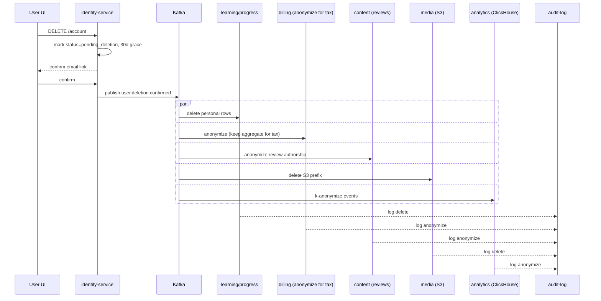
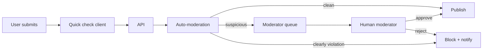

# 09 — Security & Compliance

OmniLingo Academy xử lý dữ liệu cá nhân, dữ liệu trẻ em, giọng nói, khoản thanh toán, và điểm bài kiểm tra — mỗi loại có ràng buộc pháp lý riêng. Tài liệu này mô tả mô hình bảo mật end-to-end và các requirement compliance áp dụng cho từng thị trường.

## 1. Threat model

### 1.1. Tài sản cần bảo vệ

| Tài sản | Độ nhạy | Hậu quả nếu lộ |
|---------|---------|----------------|
| Mật khẩu, refresh token | Critical | Account takeover |
| Thông tin thẻ / payment | Critical | PCI, thiệt hại tài chính, mất niềm tin |
| PII (tên, email, ngày sinh) | High | GDPR/COPPA vi phạm |
| Voice sample, bài viết của user | High | Privacy, có thể chứa thông tin nhạy cảm |
| Đáp án đề thi thật, mock test | Medium-High | Cheating, giảm giá trị content |
| Tiến độ học, SRS state | Medium | Product data, ít rủi ro cá nhân |
| Content giáo trình | Medium | Bản quyền, IP của công ty |
| Log phân tích hành vi | Low-Medium | Privacy aggregate |

### 1.2. Actors & threats

- **External attacker**: scan port, brute force, credential stuffing, DDoS, exploit lỗ hổng ứng dụng (OWASP Top 10).
- **Malicious user**: cố cheat trong test, scrape content, reverse-engineer API để farm XP/reward.
- **Compromised dependency**: npm / pypi supply-chain attack.
- **Insider**: engineer curious query, admin panel bị hijack.
- **Third-party breach**: provider AI/payment leak data.

Mô hình "zero-trust": không tin tưởng network perimeter; mọi request đều cần xác thực + phân quyền + mã hoá.

## 2. Identity & Authentication

### 2.1. User authentication

**Primary**: email + password với argon2id (m=19MB, t=2, p=1 theo OWASP khuyến nghị).

**Supported flows**:
- Email + password
- Social login: Google, Apple, Facebook, Kakao (KR), LINE (JP), Zalo (VN), WeChat (CN market).
- Magic link (passwordless).
- Passkeys (WebAuthn) — cho web + iOS/Android hiện đại, promote dần dần.
- OTP qua SMS / email cho 2FA.

Password policy: >= 10 ký tự, check HIBP (haveibeenpwned) API khi đăng ký/đổi, chặn top 10k password phổ biến. Không ép đổi định kỳ (NIST 800-63 guidance).

### 2.2. Session model

- **Access token**: JWT RS256, TTL 15 phút, chứa `sub`, `scopes`, `plan_tier`, `lang`. Không chứa PII.
- **Refresh token**: opaque, store server (Redis + Postgres), TTL 30 ngày, rotate mỗi refresh, reuse detection (nếu 1 refresh cũ bị dùng lại → revoke cả family).
- **Device binding**: refresh token gắn `device_id`. Logout = revoke device row.
- **Session listing**: user xem danh sách thiết bị active, revoke từng cái.

### 2.3. 2FA / MFA

- Optional cho free user, **bắt buộc cho teacher + admin + B2B tenant admin**.
- TOTP (Google Authenticator, Authy) + backup codes (10 mã 1 lần).
- WebAuthn khi có (hardware key, platform authenticator).

### 2.4. Service-to-service auth

- **mTLS** qua service mesh — mọi pod có short-lived cert (Linkerd / SPIRE).
- **JWT chain**: API gateway inject user JWT downstream; service muốn call service khác với user context phải forward JWT.
- **Workload identity**: dùng IRSA (IAM Roles for Service Accounts) — pod có role IAM, không dùng static credential.

### 2.5. OAuth / OIDC cho B2B

B2B tenant có thể SSO qua:
- SAML 2.0 (enterprise)
- OIDC với Google Workspace, Microsoft Entra ID, Okta
- SCIM 2.0 cho provisioning user tự động

## 3. Authorization (RBAC + ABAC)

### 3.1. Roles

Core roles: `user`, `premium_user`, `teacher`, `content_editor`, `content_admin`, `moderator`, `billing_admin`, `platform_admin`, `tenant_admin` (B2B), `tenant_learner` (B2B).

### 3.2. Policy engine

**OPA (Open Policy Agent)** chạy sidecar cho service cần phân quyền phức tạp, hoặc inline qua library.

Ví dụ rule (Rego):
```rego
# Chỉ owner hoặc tenant_admin được xem tiến độ của user
allow_progress_read {
  input.user.id == input.resource.user_id
}

allow_progress_read {
  input.resource.tenant_id == input.user.tenant_id
  "tenant_admin" in input.user.roles
}
```

### 3.3. Attribute-based

Một số resource có thêm attribute: plan_tier (Free/Plus/Pro/Ultimate), region, age_band. AI tutor có rate limit per plan_tier enforce trong `llm-gateway` bằng policy.

### 3.4. Admin access

- Admin panel không public internet — đằng sau VPN hoặc Cloudflare Access (Zero Trust).
- Mọi thao tác admin có audit log bất biến (append-only, S3 Object Lock).
- Break-glass account với MFA hardware key, review log sau mỗi lần dùng.

## 4. Data protection

### 4.1. Encryption at rest

- **RDS/Aurora**: KMS CMK per environment.
- **S3**: SSE-KMS, bucket policy deny unencrypted upload.
- **EBS**: default encryption on tại account level.
- **MongoDB Atlas**: customer-managed key (BYOK) cho prod.
- **Redis**: at-rest encryption enabled.
- **Elasticsearch/ClickHouse**: disk-level encryption.

Field-level encryption thêm một lớp cho PII nhạy (email, phone): mã hoá với key quản lý trong Vault, cho phép audit ai decrypt, khi nào.

### 4.2. Encryption in transit

- **Public**: TLS 1.3 only (TLS 1.2 minimum, disable 1.0/1.1). HSTS 1 năm + preload.
- **Internal**: mTLS qua mesh.
- **Database**: SSL/TLS required.

### 4.3. Key management

- AWS KMS làm root of trust.
- Multi-region key cho disaster recovery.
- Key rotation: AWS-managed keys auto annual; customer keys manual annual với runbook.
- HSM-backed CMK cho key ký JWT production (RS256 / EdDSA).

### 4.4. Data classification & handling

| Class | Ví dụ | Handling |
|-------|-------|----------|
| Public | Lesson public, marketing | Không cần mã hoá field |
| Internal | Aggregate stats | Encrypt rest, access log |
| Confidential | User progress, voice | Encrypt rest + transit, RBAC |
| Restricted | Password hash, PII, payment | Field encryption, audit mọi access |

## 5. Application security

### 5.1. OWASP Top 10 coverage

- **Injection**: ORM parametrized (Prisma, SQLAlchemy, GORM) — cấm raw string concat. Linter enforce.
- **Broken auth**: xem mục 2.
- **Sensitive data exposure**: class hóa (5.4).
- **XXE**: disable external entity ở XML parser; prefer JSON.
- **Broken access control**: OPA + integration test mỗi endpoint.
- **Security misconfig**: Helm chart có securityContext mặc định (runAsNonRoot, readOnlyRootFilesystem).
- **XSS**: React escape default; CSP strict + nonce cho inline; sanitize rich-text (DOMPurify).
- **Insecure deserialization**: không dùng pickle/Java serialize với input chưa verify.
- **Vulnerable components**: Dependabot + Renovate + Trivy scan image.
- **Insufficient logging**: audit log cho auth/admin event.

### 5.2. API security

- **Rate limiting** layered:
  - L1 Cloudflare: global IP-based.
  - L2 BFF/gateway: user + IP.
  - L3 service: per-feature quota (ví dụ AI tutor).
- **Input validation** mọi endpoint với schema (Zod, Pydantic, validate.v10).
- **Request signing** cho webhook (HMAC-SHA256, timestamp).
- **Idempotency key** cho POST ảnh hưởng tài chính (payment, credit consume).
- **CORS**: whitelist domain chính, không wildcard.
- **CSRF**: Hiện tại mitigated vì dùng `Authorization: Bearer` header (không cookie → CSRF không áp dụng). Nếu tương lai chuyển sang cookie-based auth, **bắt buộc** thêm CSRF token (SameSite=Strict + double-submit cookie pattern).

### 5.3. Client security

- **Mobile**: certificate pinning cho sensitive endpoint (login, payment); code obfuscation (R8/ProGuard Android, Swift minifier); jailbreak/root detection cho test proctoring.
- **Web**: CSP, SRI cho script bên ngoài, Trusted Types, SameSite=Strict cho cookie auth (dùng fetch + Authorization header thay vì cookie khi có thể).

### 5.4. Secrets & supply chain

- **No secret in repo**; pre-commit + GitHub secret scanning + truffleHog CI.
- **Signed commit** (GPG/SSH) cho committer trong protected branch.
- **SBOM** generated bằng Syft, stored với image.
- **Image sign** với Sigstore/cosign, verify trong admission controller (Kyverno / policy-controller).
- **Dependency pinning** exact version + lockfile; Renovate update có test.
- **Supply-chain levels SLSA**: mục tiêu SLSA Level 3 cho production image.

## 6. Secure SDLC

- **Threat modeling** (STRIDE) cho feature mới high-risk, trước khi code.
- **SAST**: Semgrep / CodeQL chạy PR.
- **DAST**: OWASP ZAP scan staging nightly.
- **Dependency scan**: Dependabot, Trivy.
- **Secret scan**: GitGuardian / truffleHog.
- **IaC scan**: Checkov, tfsec.
- **Container scan**: Trivy trong CI, admission-time rescan.
- **Pen test** bên ngoài: hàng năm + trước mỗi major release (tuition + payment flow).
- **Bug bounty**: mở chương trình public trên HackerOne/Intigriti sau 6 tháng vận hành.

## 7. Compliance

### 7.1. GDPR (EU), UK GDPR

Áp dụng cho user EU/UK.

- **Data subject rights**: export (SAR), delete, rectify. UI self-service trong Settings. Backend saga xoá dữ liệu xuyên các service (xem 7.6).
- **Lawful basis**: contract cho paid feature, consent cho marketing, legitimate interest cho security log.
- **Data residency**: EU user data store trong EU region (khi Year 2+ expand EU).
- **DPA** với mọi sub-processor (AWS, Cloudflare, OpenAI, Anthropic, Azure, Stripe).
- **DPO** được chỉ định khi số user EU vượt ngưỡng.
- **Breach notification**: < 72h gửi cơ quan + user khi high risk.
- **Cookies**: consent banner chuẩn IAB TCF cho tracking.

### 7.2. PDPA (Vietnam — Nghị định 13/2023)

Luật VN có nhiều điểm riêng:
- Registration of cross-border data transfer with MPS.
- Appointing local representative.
- Consent for sensitive data (sức khoẻ, tín ngưỡng, sinh trắc học — **voice sample + face proctoring thuộc sinh trắc học**).
- Consent phải ghi log rõ.

### 7.3. COPPA (US) & tương đương

Nền tảng hỗ trợ **minor** (dưới 13 Mỹ, dưới 16 EU) → cần sự đồng ý của phụ huynh xác thực (VPC — Verifiable Parental Consent).

Strategy:
- **Tuổi < 13**: chỉ cho phép qua B2B school plan (trường học là nhà cung cấp consent), hoặc parent-managed account trong Family Plan.
- **Tuổi 13-17**: account độc lập nhưng limited — không social feature public, không tutor marketplace 1-1, không marketing communication.
- **Parental controls**: Family Plan admin có thể xem tiến độ, giới hạn thời gian dùng, duyệt tutor booking.

Account kid-mode: UI đơn giản, không comment public, moderation AI mọi content nhận/gửi.

### 7.4. PCI-DSS

Không lưu PAN (số thẻ) trên hệ thống ta. Stripe/VNPay/MoMo xử lý, ta chỉ lưu token.

- **SAQ A** (e-commerce, outsourced) là target compliance — cần ta:
  - Serve payment page từ provider iframe / redirect.
  - Không có script ta can thiệp field card.
  - Log access để audit.

### 7.5. Exam / certification prep integrity

- Mock test / proctored exam có **recording quyền** (webcam, screen, mic) cần explicit consent, có purpose limitation, retention < 30 ngày (hoặc ngắn hơn theo jurisdiction), không dùng cho training AI trừ khi re-consent.
- Watermark code khi display đề thật để phát hiện leak.
- Rate limit xem đề — pattern scraping (quá nhiều view lesson/phút) → challenge.

### 7.6. Data deletion saga

Xoá user trigger một saga qua Kafka `user.deletion.requested`:



Exception: dữ liệu phải giữ cho nghĩa vụ pháp lý (hoá đơn, chống rửa tiền) → lưu anonymized ở bảng riêng có retention theo luật (thường 5-10 năm).

### 7.7. Data retention summary

| Data | Retention | Note |
|------|-----------|------|
| Access log | 13 tháng | GDPR justification |
| Audit log | 7 năm | Compliance |
| Voice sample (pronunciation) | 90 ngày default; opt-in longer | User setting |
| Proctoring recording | 30 ngày | Scrub sau |
| Chat với AI tutor | 13 tháng trừ khi user xoá | Show in UI |
| Tax / invoice | 5-10 năm (theo quốc gia) | Không xoá khi delete account |
| Training data opt-in | Vô thời hạn đến khi user withdraw | Withdraw clears downstream |

## 8. Content moderation

### 8.1. User-generated content

Nền tảng có UGC: bình luận, review tutor, bài viết cho AI chấm, voice sample, forum Q&A.

Pipeline:



Auto-moderation stack:
- **Perspective API** (Google) cho toxicity scoring.
- **OpenAI Moderation** cho sexual/violence/hate.
- Custom model finetune cho tiếng VN (prompt injection + slang).
- Image/voice: Amazon Rekognition / Azure Content Safety.

Different thresholds per context: comment chat tutor session strict hơn forum; bài viết AI chấm chỉ filter spam/abuse chứ không filter content ngôn ngữ (user viết sai có thể là "f*ck" như content học tiếng Anh).

### 8.2. Proctoring & anti-cheat

Cho mock test "invigilated":
- Webcam feed → streaming pose estimation (có nhìn lung tung, có người khác xuất hiện không).
- Mic ambient sound detection (có người nhắc bài không).
- Tab switch / copy-paste event logged.
- Hành vi bất thường → flag, moderator review trước khi issue score.

Không block user tự động vì false positive cao — luôn human-in-the-loop.

## 9. Privacy for AI

### 9.1. Vendor data handling

- **Anthropic Claude API**: enterprise tier với zero data retention (opt-out training) — bắt buộc dùng tier này cho prod.
- **OpenAI API**: business tier zero retention.
- **Azure OpenAI**: tenant isolation, không train chung.
- **Whisper self-host**: không có vendor data flow.

Checklist mọi vendor AI mới:
- DPA signed.
- No training on our data (trừ opt-in tenant-specific fine-tune).
- Data residency acceptable cho EU user.
- SOC 2 Type II minimum.

### 9.2. Inline PII redaction

`llm-gateway` (xem [07](./07-ai-ml-services.md)) redact PII trước khi forward prompt ra vendor:
- Email, phone, credit card, địa chỉ — regex + NER.
- Replace bằng placeholder `[EMAIL]`, log count để audit.

### 9.3. User transparency

- Settings page: "Data & AI" với toggle cho:
  - "Dùng voice sample để cải thiện pronunciation scoring" (default off).
  - "Dùng bài viết để cải thiện AI grading" (default off).
  - Nút download tất cả dữ liệu AI interaction.

## 10. Security monitoring

### 10.1. Logging & alerting

- **AuthN/AuthZ event** → SIEM (AWS Security Lake / self-host Wazuh).
- **Admin action** → audit log immutable (S3 Object Lock compliance mode).
- **Anomaly detection**: login từ country mới, nhiều thiết bị cùng lúc, đăng ký hàng loạt — challenge (captcha / email verify).
- **CloudTrail** mọi region, multi-account trail.
- **GuardDuty** enabled, alert P2.

### 10.2. Incident response

Severity:
- **Sev1**: data breach, service full down → on-call + security lead + legal + CEO.
- **Sev2**: material compromise, partial outage → on-call + security lead.
- **Sev3**: lower risk, e.g. single account takeover → on-call handle hours time.

Runbook chuẩn cho top scenario (credential leak, data exfiltration, ransomware, account takeover campaign). Tabletop exercise quý 1 lần.

### 10.3. Vulnerability management

- CVE known critical → patch < 72h.
- High → < 7 ngày.
- Medium → < 30 ngày.
- Exposed attack surface (login page, API) prioritized.

## 11. Compliance roadmap

| Giai đoạn | Compliance target |
|-----------|-------------------|
| MVP (0-6 tháng) | GDPR-ready, PDPA VN, PCI SAQ A, COPPA-minor-via-B2B only |
| Phase 2 (6-18 tháng) | SOC 2 Type I → Type II, ISO 27001 |
| Phase 3 (18-36 tháng) | FERPA (nếu bán cho K-12 Mỹ), China data governance (nếu open CN), Trusted Learner Network cert |

---

**Tham chiếu**: [07 — AI/ML Services](./07-ai-ml-services.md) (vendor list) · [08 — Infrastructure](./08-infrastructure-and-deployment.md) (KMS, VPC) · [10 — Monetization](./10-subscription-and-monetization.md) (PCI scope) · [12 — Observability](./12-observability-and-sre.md) (audit log pipeline)
