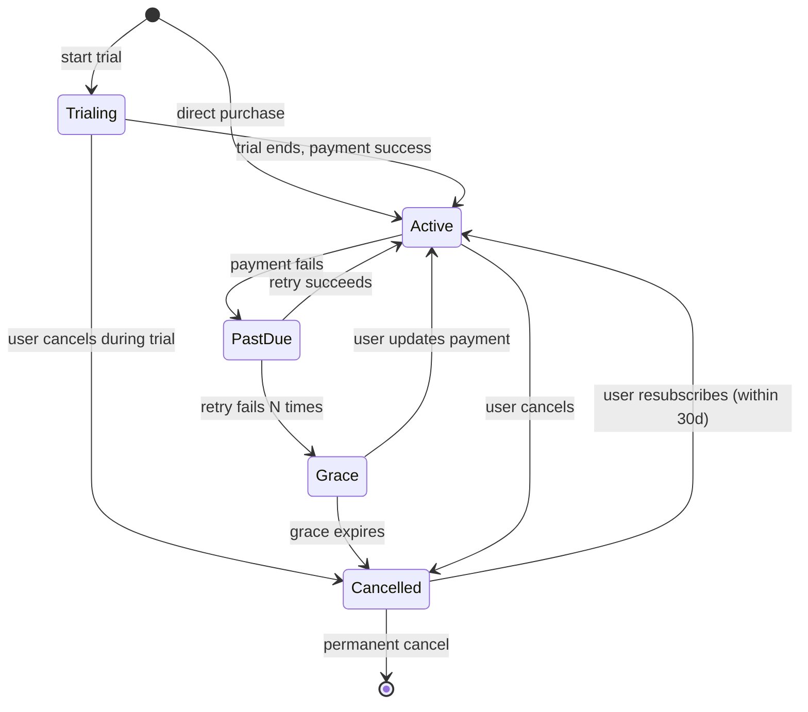

# 10 — Subscription & Monetization

Tài liệu này chi tiết hoá chiến lược doanh thu, cấu trúc gói, tích hợp payment, vòng đời subscription và các kênh monetization phụ như Marketplace, B2B, Gift.

## 1. Chiến lược doanh thu

### 1.1. Nguyên tắc

1. **Freemium là phễu, không phải đích**: free phải đủ giá trị để viral và tạo habit (streak, SRS), nhưng bị giới hạn đủ để nâng cấp khi user serious.
2. **Đa dạng payment local**: VN user không dùng thẻ quốc tế, phải có MoMo/ZaloPay/VNPay; CN user cần Alipay/WeChat Pay; JP có Konbini pay; KR có Toss/KakaoPay.
3. **Mobile IAP chiếm lớn**: ~50-70% user mua trên iOS/Android → phải chấp nhận commission 15-30% của Apple/Google.
4. **Annual > Monthly**: discount annual (20-40% off) đẩy churn ↓, LTV ↑.
5. **Transparent**: không dark pattern (ẩn nút huỷ, auto-upgrade ngầm). Cancellation flow < 3 click.

### 1.2. Unit economics target

| Metric | Year 1 | Year 2 | Year 3 |
|--------|--------|--------|--------|
| Free → paid conversion | 3-5% | 5-7% | 7-10% |
| Monthly churn (paid) | 8-10% | 5-7% | 3-5% |
| ARPPU (tháng) | ~150k VND | ~180k | ~220k |
| CAC payback | 9-12 tháng | 6-9 tháng | 4-6 tháng |
| LTV/CAC | > 2 | > 3 | > 4 |

## 2. Pricing tiers

### 2.1. Cấu trúc gói

| Gói | Giá tháng (VN) | Giá năm (VN) | Giá quốc tế | Đối tượng |
|-----|----------------|--------------|-------------|-----------|
| **Free** | 0 | 0 | 0 | Thử nghiệm, habit |
| **Plus** | 99k | 899k (-24%) | $3.99 / $39.99 | 1 ngôn ngữ, học hằng ngày |
| **Pro** | 249k | 1,999k (-33%) | $9.99 / $99.99 | Multi-language + AI tutor không giới hạn |
| **Ultimate** | 599k | 4,999k (-30%) | $19.99 / $199.99 | Pro + tutor credit + live class |
| **Family** | 399k | 3,499k (-27%) | $14.99 / $149.99 | Tối đa 6 member, Pro features |
| **Schools** (B2B) | Custom | Custom | Custom | Trường học |
| **Enterprise** (B2B) | Custom | Custom | Custom | Công ty đào tạo ngôn ngữ cho NV |

### 2.2. Feature comparison matrix

| Tính năng | Free | Plus | Pro | Ultimate | Family |
|-----------|------|------|-----|----------|--------|
| Số ngôn ngữ học đồng thời | 1 | 1 | Tất cả | Tất cả | Tất cả |
| Bài học/ngày | 5 | Không giới hạn | Không giới hạn | Không giới hạn | Không giới hạn |
| SRS flashcard | Có (giới hạn 500 card) | Không giới hạn | Không giới hạn | Không giới hạn | Không giới hạn |
| Listening dictation | Có (giới hạn) | Có | Có | Có | Có |
| Pronunciation scoring | 5 lần/ngày | Không giới hạn | Không giới hạn (advanced) | Không giới hạn (advanced) | Không giới hạn |
| AI chat tutor | 10 msg/ngày (basic model) | 50 msg/ngày | Không giới hạn (Claude) | Không giới hạn + voice | Không giới hạn |
| AI grading writing | 1 bài/tuần | 3 bài/tuần | Không giới hạn | Không giới hạn | Không giới hạn |
| Mock test chứng chỉ | 1 đề/loại | 3 đề/tháng | Không giới hạn | Không giới hạn + proctored | Không giới hạn |
| Offline mode | ❌ | ✅ | ✅ | ✅ | ✅ |
| Quảng cáo | Có | Không | Không | Không | Không |
| Tutor credit 1-1 | ❌ | ❌ | ❌ | 4 giờ/tháng (60 credit) | ❌ |
| Live group class | ❌ | ❌ | 2 lớp/tháng | Không giới hạn | 2 lớp/tháng |
| Advanced analytics | ❌ | Basic | Full | Full | Full |
| Priority support | ❌ | ❌ | Email 24h | Email 4h + chat | Email 24h |
| Family members | 1 | 1 | 1 | 1 | 6 |

### 2.3. Pricing localization

Giá **mua sức ngang giá** (PPP) cho từng thị trường:

| Thị trường | Plus tháng | Pro tháng | Ghi chú |
|-----------|-----------|-----------|---------|
| VN | 99k | 249k | Baseline |
| ID/PH/TH | Rp 59k / ₱199 / ฿129 | Rp 149k / ₱499 / ฿329 | PPP adjusted |
| US/UK/DE | $3.99 / £3.99 / €3.99 | $9.99 / £9.99 / €9.99 | Mỹ + Tây Âu |
| JP | ¥600 | ¥1,480 | Chấp nhận Konbini + Suica |
| KR | ₩5,500 | ₩13,900 | Chấp nhận Toss/KakaoPay |
| CN | ¥29 | ¥69 | Chấp nhận Alipay/WeChat |
| IN | ₹199 | ₹499 | PPP, popular market |

Giá hiển thị đã bao gồm VAT/thuế GTGT tại cấp region — tính toán phía server khi tạo checkout session.

## 3. Payment providers

### 3.1. Portfolio

| Provider | Regions | Methods | Note |
|----------|---------|---------|------|
| **Stripe** | Global ex CN/VN primary | Card, Apple Pay, Google Pay, SEPA, BACS, ACH | Primary international |
| **VNPay** | VN | ATM card, internet banking, QR | VN domestic card |
| **MoMo** | VN | E-wallet, QR | Mobile-native VN |
| **ZaloPay** | VN | E-wallet, QR | VN tier 2 |
| **PayOS** / **OnePay** | VN | Backup processor | Failover |
| **Apple IAP** | iOS | Apple ID | Bắt buộc với subscription trên iOS |
| **Google Play Billing** | Android | Google ID | Bắt buộc với subscription trên Android |
| **Alipay** | CN + global CN user | E-wallet, QR | CN market |
| **WeChat Pay** | CN | E-wallet, QR | CN market |
| **Toss Payments** | KR | Card, Toss wallet | KR market |
| **KakaoPay** | KR | KR wallet | KR market |
| **PayPay** | JP | E-wallet | JP market |
| **Konbini** | JP | Cash at convenience store | JP cash user |
| **Razorpay** | IN | UPI, card, wallet | IN market |

### 3.2. Abstraction: payment-service

Các service upstream không gọi trực tiếp provider. `billing-service` (Go) + `payment-service` (Go) chia trách nhiệm theo adapter pattern:

```
billing-service (Go)                   payment-service (Go)
├── internal/service/                  ├── internal/adapter/
│   ├── subscription_service.go        │   ├── stripe_adapter.go
│   ├── invoice_service.go             │   ├── vnpay_adapter.go
│   └── tax_service.go                 │   ├── momo_adapter.go
└── (subscription lifecycle)           │   ├── apple_iap_adapter.go
                                       │   └── google_play_adapter.go
                                       └── (payment processing + webhook)
```

> **Lưu ý**: billing-service quản lý subscription lifecycle (trial, renew, cancel, prorate). payment-service quản lý provider integration + webhook + idempotent payment processing.

Adapter chuẩn hoá event:
- `payment.initiated`
- `payment.succeeded`
- `payment.failed`
- `subscription.created / renewed / cancelled / upgraded`
- `refund.processed`

### 3.3. Webhook handling

Mọi provider gửi webhook → endpoint `/webhooks/<provider>`:
- Verify signature (HMAC / JWT).
- Idempotent bằng `event_id` check Redis + DB.
- Push vào Kafka `billing.payment.events` → các service subscribe (subscription-service update state, notification-service gửi email, analytics log).

Dead-letter queue nếu processing fail; retry exponential; alert sau 5 retry fail.

## 4. Subscription lifecycle

### 4.1. States



### 4.2. Trial

- **7 ngày trial** miễn phí cho Plus, Pro mới đăng ký lần đầu.
- Yêu cầu payment method để bắt đầu trial (reduce churn).
- Email nhắc nhở trial sắp kết thúc: ngày 5, ngày 6, ngày 7.
- User có thể huỷ bất kỳ lúc nào trong trial, không bị charge.

### 4.3. Proration (upgrade/downgrade)

**Upgrade Plus → Pro**: charge ngay phần chênh lệch trên số ngày còn lại:
```
amount_due = (pro_price - plus_price) * (days_remaining / days_in_period)
```

**Downgrade Pro → Plus**: không refund; gói cao giữ đến hết kỳ, kỳ sau mới về Plus.

**Tần suất billing**: user chuyển tháng → năm được pro-rated credit về tháng sau.

### 4.4. Dunning (failed payment retry)

Khi payment fail, `billing-service` (subscription sub-module) schedule retry:
- **Day 0**: retry ngay (ngân hàng có thể tạm outage).
- **Day 3**: retry + email "payment failed, please update".
- **Day 7**: retry + in-app banner.
- **Day 10**: retry + email cuối, "tomorrow your account will lose premium access".
- **Day 11**: chuyển sang Grace state, mất access.
- **Day 30**: cancel permanent.

Smart retry: dùng Stripe Smart Retry / custom ML predict ngày nào user có tiền (pay day).

### 4.5. Cancellation flow

Best practice:
1. Click "Cancel subscription".
2. Ask lý do (list + free text). Log analytics.
3. Offer retention:
   - Price concern → discount 30% 3 tháng.
   - Not using → pause (3 tháng freeze, không charge, reactivate bất kỳ lúc nào).
   - Switch product → offer Plus nếu đang Pro.
4. Confirm.
5. Giữ access đến hết kỳ đã thanh toán.
6. Email confirm + feedback survey.

Không auto-renew sau huỷ. Không gửi quá 2 email marketing "come back" trong 30 ngày.

### 4.6. Refunds

Policy:
- **< 7 ngày sau mua lần đầu**: refund 100% theo yêu cầu.
- **Annual plan, > 30 ngày**: refund proportional cho phần chưa dùng, trừ phí xử lý.
- **Sau 30 ngày gói tháng**: no refund trừ khi có sự cố dịch vụ của ta.
- **Mobile IAP**: theo chính sách Apple/Google (thường khó hơn, điều phối qua app store).

Xử lý qua admin panel → `refund-service` → gọi provider API → update subscription state → notify user.

## 5. Tax handling

### 5.1. Rule engine

Thuế phụ thuộc:
- Country của buyer (billing address).
- Customer type (B2C vs B2B với VAT number).
- Digital service luật pháp (EU VAT MOSS, UK VAT, Aus GST, NZ GST, SG GST, etc.).

Dùng **Stripe Tax** cho international (auto compute + file), **Avalara** cho US state-by-state khi scale. VN dùng logic riêng (VAT 10%, export invoice điện tử theo Nghị định 123/2020).

### 5.2. Invoice

- Invoice PDF generated per charge, gửi qua email + download trong Settings.
- Invoice số liên tục theo quốc gia, lưu `tax_service` DB.
- VN: tích hợp e-invoice provider (MISA, VNPT, Viettel) — auto sign và gửi đến thuế.
- Retention 10 năm.

## 6. Content & feature monetization phụ

### 6.1. Marketplace (content)

Creator / certified teacher có thể publish paid course, flashcard deck cao cấp, mock test bank.

Model:
- Platform fee: 30% (giảm dần 20%, 15% cho top creator).
- Payout qua Stripe Connect / Payoneer / bank transfer VN.
- 1099 / tax reporting tự động.

Revenue share cho B2B school publishing course: thương lượng per-contract.

### 6.2. Tutor marketplace (1-1, group)

- Commission 15-25% tuỳ experience level.
- Ultimate plan có credit 60/tháng (~4 giờ với giá giáo viên trung bình).
- Escrow model: học viên trả trước, platform giữ, release cho tutor sau khi session xong + 24h dispute window.
- Cancellation: <24h tutor giữ 50%, >24h refund đầy đủ.

### 6.3. Live group class

Pro: 2 lớp/tháng miễn phí (included). Mua thêm bằng credit hoặc one-time ticket.

### 6.4. Gift & referral

**Gift**:
- Mua subscription tặng người khác (email → code activate).
- Gift box 1/3/6/12 tháng.
- Không auto-renew.

**Referral**:
- User mời bạn → khi bạn subscribe: cả 2 cùng nhận 1 tháng miễn phí (capped 3 referral/năm).
- Link unique + attribution qua `referral-service`.
- Fraud detection: cùng device, cùng payment → block.

### 6.5. Certificate fee

Ultimate user có thể mua "Certificate of Completion" cho khoá học: 99k/cert, verify qua QR public URL. Không phải chứng chỉ quốc gia, nhưng có giá trị cho LinkedIn / portfolio.

## 7. B2B monetization

### 7.1. Schools plan

Target: trường học K-12, đại học, trung tâm ngoại ngữ VN.

Model pricing:
- **Per seat / year**: $30-60/seat/year (tuỳ size + commitment).
- **Site license**: fixed fee cho < 500 seat, negotiate.
- Include: admin dashboard, class management, assignment tool, progress report PDF, SSO, white-label (optional).

### 7.2. Enterprise plan

Target: công ty đào tạo tiếng Anh/Nhật/TQ cho nhân viên (outsource, manufacturing, IT services).

Pricing:
- **Volume tier**: $60-120/seat/year.
- Include: Schools features + API, custom report, dedicated CSM, training, SCIM provisioning, SAML SSO.

### 7.3. Procurement

- MSA + DPA + SLA (99.9% uptime, credit-back).
- Quarterly business review cho account > 500 seat.
- Invoice thanh toán net-30 hoặc net-60 (annually upfront ưu tiên với discount 10%).

## 8. Revenue observability

### 8.1. Metrics

Dashboard realtime:
- **MRR** (monthly recurring revenue) — breakdown per tier, per country.
- **ARR** (annual recurring revenue).
- **Net new MRR**: new + expansion – churn – downgrade.
- **Cohort retention** curve 1/3/6/12 tháng.
- **CAC** per channel (paid, organic, referral, B2B sales).
- **LTV** per tier, per country, per acquisition channel.
- **Payment failure rate** per provider (monitor provider degradation).
- **Refund rate** per tier.

Pipeline: `billing-service` → ClickHouse raw events → dbt model → BI (Metabase / Lightdash) + exec dashboard (Grafana).

### 8.2. Experiments

A/B test pricing, trial length, onboarding paywall timing, upsell banner. Tool: GrowthBook (self-host) + analytic via Mixpanel/PostHog.

Không A/B test pricing cho user đã mua — chỉ tested cho new signup cohort, tránh vi phạm expectation.

## 9. Fraud prevention

- **Payment fraud**: Stripe Radar, per-provider fraud score. Manual review threshold.
- **Promo abuse**: detect multi-account same device/IP, phone verify cho trial cao giá trị.
- **Chargeback**: response pack tự động với evidence (login time, usage data, T&C acknowledgment), minimize loss rate.
- **Account sharing** (Family plan): không chặn cứng (bad UX), nhưng flag household khi > 8 devices active.

## 10. Checklist triển khai

- [ ] Payment adapter cho mỗi provider có unit test + integration test với sandbox.
- [ ] Idempotency end-to-end cho payment → subscription flip.
- [ ] Dry-run renew trong staging hàng ngày.
- [ ] Billing events đi vào data warehouse within 15 min.
- [ ] Customer support có tool refund 1-click, grace extend.
- [ ] Every price hiển thị UI = price backend compute (không hard-code frontend).
- [ ] Localization: currency symbol, tax display rules per country.
- [ ] Invoice PDF accessible 10 năm.
- [ ] Email template: 8 pattern (welcome, trial end, renewal success, renewal fail, grace, cancel, winback, refund).
- [ ] Subscription state transitions đều emit Kafka event.

---

**Tham chiếu**: [04 — Microservices](./04-microservices-breakdown.md) (billing-service, subscription-service) · [09 — Security](./09-security-and-compliance.md) (PCI) · [12 — Observability](./12-observability-and-sre.md) (dashboards) · [13 — Roadmap](./13-roadmap-and-phasing.md) (phase rollout)
