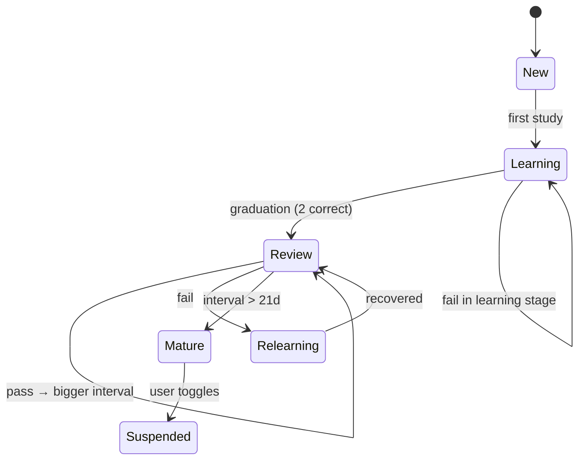

# 11 — Learning Paths & Curriculum

Bài này trả lời câu hỏi "người dùng học cái gì, theo thứ tự nào, và hệ thống quyết định điều đó ra sao". Đây là "trái tim pedagogical" của nền tảng, gắn chặt với `learning-service`, `curriculum-service`, `srs-service`, `assessment-service`, `recommendation-service` (xem [04](./04-microservices-breakdown.md)).

## 1. Khung chuẩn năng lực (proficiency frameworks)

### 1.1. Các khung được hỗ trợ

| Ngôn ngữ | Khung chính | Khung phụ |
|---------|------------|-----------|
| Anh | CEFR (A1→C2) | TOEFL iBT, IELTS 0-9, TOEIC 10-990, Cambridge |
| Nhật | JLPT (N5→N1) | CEFR mapping, J.Test |
| Trung | HSK 1-9 (new HSK 3.0) | CEFR mapping, TOCFL (Taiwan) |
| Hàn | TOPIK 1-6 | CEFR mapping |
| Pháp | CEFR (A1-C2) | DELF/DALF, TCF |
| Đức | CEFR (A1-C2) | Goethe, TestDaF |
| TBN | CEFR (A1-C2) | DELE, SIELE |
| Việt (cho ngoại) | VFL (VN Framework for Foreign Learners, 6 bậc) | CEFR mapping |

Nội bộ, chúng ta normalize qua một thang **OmniLingo Level (PL) 0-12** tương đương CEFR mở rộng, để trộn chéo các ngôn ngữ:

| PL | CEFR | JLPT | HSK new | TOPIK | IELTS |
|----|------|------|---------|-------|-------|
| 0-1 | Pre-A1 | – | HSK 1 | Pre-TOPIK 1 | – |
| 2 | A1 | N5 | HSK 2 | TOPIK 1 | 2.0-3.0 |
| 3-4 | A2 | N4 | HSK 3 | TOPIK 2 | 3.5-4.0 |
| 5-6 | B1 | N3 | HSK 4-5 | TOPIK 3 | 4.5-5.5 |
| 7-8 | B2 | N2 | HSK 6-7 | TOPIK 4 | 6.0-6.5 |
| 9-10 | C1 | N1 | HSK 8 | TOPIK 5 | 7.0-7.5 |
| 11-12 | C2 | – | HSK 9 | TOPIK 6 | 8.0-9.0 |

Mapping không tuyệt đối 1-1 (JLPT và CEFR không thực sự đo cùng thứ), nhưng đủ cho mục đích placement + recommendation.

### 1.2. Bốn kỹ năng độc lập

Mỗi user có **4 sub-level** riêng: Listening, Reading, Speaking, Writing. Cộng thêm 2 proxy skill: Vocabulary Size (Lex) và Grammar Control (Gram).

Tại sao? Người học tiếng Nhật thường "đọc tốt, nói kém"; người luyện IELTS thường "Listening tốt, Writing yếu". Single-number level giấu mất gap.

UI hiển thị "hexagon chart" 6 trục: L, R, S, W, Vocab, Grammar.

## 2. Curriculum structure

### 2.1. Taxonomy

```
Language (e.g., Japanese)
 └── Track (e.g., "General Japanese", "JLPT Prep", "Business Japanese")
      └── Unit (thematic, ~1 tuần) — e.g., "Transportation"
           └── Lesson (~10-15 phút) — e.g., "Asking for directions"
                └── Activity (1-3 phút mỗi cái)
                     ├── Vocabulary activity
                     ├── Grammar activity
                     ├── Listening activity
                     ├── Speaking activity
                     ├── Reading activity
                     ├── Writing activity
                     └── Mini-quiz activity
```

Một language thường có 5-10 tracks. Một track 30-60 units. Một unit 5-10 lessons. Một lesson 4-8 activities.

Tổng lượng content cho 1 language từ A1 tới C1: ~200 units × 7 lessons × 5 activities = **~7,000 activities**. Tốn, nhưng là "moat" của platform.

### 2.2. Skill tree vs linear path

**Skill tree** (kiểu Duolingo): cho General track — unit branching theo topic, user tự chọn order trong giới hạn prerequisite.

**Linear path**: cho Test Prep track — JLPT N3 prep có order cố định, gắn với deadline thi.

Quyết định per-track, không per-platform.

### 2.3. Tagging content

Mỗi activity có metadata:

```json
{
  "activity_id": "jp_a1_transpo_001",
  "language": "ja",
  "cefr": "A1",
  "jlpt": "N5",
  "omnilingo_level": 2,
  "skills": ["listening", "vocabulary"],
  "grammar_points": ["te-form", "ni-particle"],
  "vocab_refs": ["eki", "densha", "basu"],
  "topics": ["transportation", "asking-directions"],
  "difficulty": 0.38,          // IRT parameter b
  "discrimination": 1.2,       // IRT parameter a
  "estimated_time_sec": 90,
  "content_hash": "...",
  "version": 4
}
```

Rich tagging cho phép:
- Query "cho tôi 10 hoạt động A2 về transportation liên quan grammar te-form".
- Diagnostic test pick theo discrimination cao.
- Recommender hiểu weakness → target.

## 3. Placement test (onboarding)

### 3.1. Mục tiêu

Khi user mới chọn ngôn ngữ, đoán PL ± 1 level trong ~5-10 phút.

### 3.2. Adaptive algorithm (CAT — Computer Adaptive Testing)

Dùng **2PL IRT** (Item Response Theory) ban đầu, upgrade 3PL / MIRT khi đủ data.

Pseudocode:
```
theta = 0   # initial ability estimate (logit scale)
items_used = []
while not stop_condition():
    next_item = select_item(pool, theta, exclude=items_used)
    response = present(next_item)
    theta = update_mle(theta, items_used + [next_item], responses + [response])
    se = standard_error(theta)
    if se < 0.3 or len(items_used) >= 20:
        stop()
```

Stop rule: SE < 0.3 hoặc 20 items hoặc 10 phút — whichever first.

Item selection: Fisher information maximization có pha random (top 3 chọn random) để tránh item exposure.

### 3.3. Multi-skill placement

Không chỉ 1 theta. Chạy diagnostic riêng cho 4 skill, mỗi skill ~3-5 items. Trade: accuracy vs time.

Result: hexagon chart + suggested starting unit per track.

### 3.4. Opt-out

User nói "tôi biết N3 rồi" — show option "skip placement, start at N3". Vẫn chạy light diagnostic sau 3 bài để validate.

## 4. Spaced Repetition System (SRS)

### 4.1. Chọn FSRS thay vì SM-2

**SM-2** (Anki truyền thống) có vấn đề:
- Tham số giống nhau cho mọi user.
- Không học được personal forgetting curve.
- Interval tăng nhanh quá cho hard items.

**FSRS (Free Spaced Repetition Scheduler)** v4/v5:
- Model 3 biến latent per card: D (difficulty), S (stability), R (retrievability).
- Per-user parameter tuned từ lịch sử review.
- Dự đoán next interval cho target retention (e.g., 0.9).

Research cho thấy FSRS đạt retention target với ít review hơn 20-40% so với SM-2.

### 4.2. Card lifecycle



### 4.3. Rating scale

4 buttons sau mỗi review:
- **Again** (forget) — lapse, reset stability heavy.
- **Hard** — giảm interval, nhẹ D up.
- **Good** — default success, target retention.
- **Easy** — tăng interval nhẹ thêm.

### 4.4. Lưu trữ & compute

`srs-service` (Rust, xem [06](./06-tech-stack.md)):
- Postgres bảng `srs_card(user_id, card_id, due_at, stability, difficulty, last_review_at, state)`.
- Khi user mở "Review", query:
  ```sql
  SELECT card_id FROM srs_card
  WHERE user_id = $1 AND due_at <= NOW()
  ORDER BY due_at ASC
  LIMIT 30;
  ```
- Redis cache "due count" per user để hiển thị badge.
- Batch retune FSRS params per user mỗi 2 tuần (Kafka event → ML pipeline), push params update về Postgres.

### 4.5. Card sources

- Vocabulary gặp trong lesson → auto-add vào SRS pool với option user disable.
- Kanji / Hanzi character deck per language.
- Phrases từ dictation / speaking.
- User custom deck (import CSV, share deck public — marketplace).

Multi-deck per language, user toggle deck on/off cho mỗi session review.

### 4.6. Retention target tuning

Default R target = 0.9. User có thể slider (0.8 - 0.95):
- 0.8: review ít hơn nhưng quên nhiều.
- 0.9: balanced (default).
- 0.95: review nhiều, quên ít — cho cert prep.

## 5. Daily session flow

### 5.1. "Goal-based daily routine"

User set daily goal (5/15/30/60 phút). Hệ thống compose session gồm:

| Block | Tỷ lệ | Nguồn |
|-------|-------|-------|
| SRS review (due) | ~30% | `srs-service` queue |
| New content lesson | ~40% | Next lesson in track |
| Weak-point remediation | ~15% | Based on skill weakness model |
| Review của lesson trước (consolidation) | ~10% | Adaptive |
| "Fun" (story, culture video) | ~5% | Engagement |

Tỷ lệ adjust theo:
- Ngày streak: Monday push new content, weekend lighter.
- Performance: fail hôm qua → today tăng remediation.
- Plan: Test Prep user increase mock question %.

### 5.2. Session composition service

`recommendation-service` receive query `compose_session(user_id, duration_min=15)` → return ordered list activities.

Algorithm: multi-armed contextual bandit (Thompson Sampling) reward = engagement + retention proxy. Features: user level, last-session performance, content difficulty, freshness, topic diversity.

Cold-start (< 10 sessions): rule-based composition, collect data.

## 6. Adaptive difficulty

### 6.1. Trong lesson

Lesson có "difficulty band" — activity trong band đó có `b` parameter trong [band_low, band_high].

Sau mỗi 3 answer:
- Accuracy > 0.85 → raise band 0.1.
- Accuracy < 0.55 → lower band 0.1.
- Else hold.

Tránh frustration (quá khó) và boredom (quá dễ) — "zone of proximal development".

### 6.2. Mock test difficulty

Cho test prep, không adjust difficulty (phải reflect đề thật). Thay vào đó, **select mock test** phù hợp predicted score:
- User predicted TOEIC 650 → show mock với full range 400-900 questions nhưng mix proportion match 650 difficulty.
- Proctored mock: fixed standard form.

## 7. Weakness detection & remediation

### 7.1. Skill atom tracking

Mỗi grammar point / phoneme / vocab topic = "atom". User state per atom:
- `exposure_count`
- `recent_accuracy` (rolling 10 attempts)
- `mastery_score` (Bayesian posterior)

Atom được tag từ content metadata.

### 7.2. Remediation trigger

Khi `mastery_score < 0.4` + `exposure >= 5`:
- Flag atom là "weak".
- `recommendation-service` inject 1-2 remediation activity mỗi session đến khi score > 0.6.

### 7.3. Personalized explanation

AI tutor có thể generate mini-lesson khi user fail: "Bạn vừa sai 3 lần về 助詞 に — đây là 3 ví dụ khác nhau để hiểu pattern" (xem AI tutor [07](./07-ai-ml-services.md)).

## 8. Test prep paths

### 8.1. Cấu trúc đặc thù

Test prep khác general path:
- **Deadline-driven**: user nhập ngày thi → work back plan.
- **Section-weighted**: IELTS Writing weak → tăng % writing practice.
- **Mock-centric**: schedule 1 full mock/week, scale up 2/week tháng cuối.
- **Score trajectory dashboard**: predict + actual mock trend.

### 8.2. Plan generator

Input: target cert + level (IELTS 7.0), current baseline (IELTS 5.5 from diagnostic), deadline (60 ngày).

Output:
- 60-day plan (daily blocks).
- Weekly mock schedule.
- Section allocation per user weakness.
- Milestone: Day 15 diagnostic re-check, Day 30 mid-plan mock, Day 55 final mock, Day 58 light revision.

Generator: rule engine + optimization (LP giải đơn giản cho time allocation).

### 8.3. Test-day readiness check

Ngày trước thi, UI show:
- Readiness score (0-100) tổng hợp từ predicted + recent perf.
- "Last-minute" cheatsheet tip.
- Tắt notification stress.

## 9. Multi-language learning

User học đồng thời nhiều ngôn ngữ (thường 2-3 cùng lúc):
- **Separate progress** per language (FSRS state, level, streak).
- **Cross-language interference detection**: nếu user học JP+KR, detect khi confuse particle — show "tip: JP wa ≠ KR 은/는 exactly".
- **Session split**: daily goal 30 min → user allocate 20/10 hoặc alternate days.
- Unified streak: học bất kỳ ngôn ngữ nào count streak.

## 10. Content authoring pipeline

### 10.1. Tool chain

Content editor dùng **content-cms** (xem [04](./04-microservices-breakdown.md)):

- Structured editor (Strapi hoặc headless CMS custom + Tiptap) cho lesson.
- Preview student view.
- Versioning, review workflow (editor → lead → published).
- AI assist: auto-draft example sentences, draft distractors, translate (human review mandatory).

### 10.2. Quality gates

Mỗi activity trước publish:
- Linguist review (native speaker).
- **Item analysis** sau 100 user: p-value (khó quá / dễ quá), point-biserial (discrimination). Flag outlier revise.
- Accessibility: audio có transcript, image có alt text.

### 10.3. Versioning

Published content **immutable** — revise = new version, backfill progress mapping.

### 10.4. Localization

UI language ≠ learning language. UI hỗ trợ: VN, EN, JP, CN (simplified), KR, ES, FR, DE. Content explanations localized per UI language (ví dụ: "The particle は marks the topic" hiển thị tiếng Việt cho user VN).

Translation workflow:
- Source: English explanation.
- AI draft translation → native editor review.
- Store per-locale trong MongoDB content doc.

## 11. Gamification pedagogy

### 11.1. Nguyên tắc

- Gamification là "scaffold" cho habit, không thay động lực nội tại.
- Tránh dark pattern (loot box, timed FOMO thái quá).
- Reward có giá trị pedagogical (hint token có thể "freeze" streak 1 ngày, không buy advantage).

### 11.2. Element

- **Streak**: ngày liên tục học > 5 phút. Freeze token (1/tháng free, 5 Plus, unlimited Pro).
- **XP**: per activity complete. Level 1-100.
- **Leagues**: weekly bronze → diamond như Duolingo. Opt-out cho người không thích compete.
- **Achievements**: 200+ badges theo skill + thời gian + event.
- **Quests**: daily/weekly mission with meaningful goal.

Important: leaderboard không hiển thị real name public by default — username hoặc display name tuỳ chọn.

## 12. Offline support

### 12.1. Strategy

- Mobile download lesson pack (audio + JSON) per unit ~5-20 MB.
- SRS session hoạt động offline — queue local SQLite, sync khi online.
- Speaking activity cần mạng (send audio lên server) — offline báo tạm ẩn; alternative: local pronunciation scoring (Phase 2 on-device model).
- AI tutor chat: require online.

### 12.2. Conflict resolution

Dữ liệu SRS offline có thể conflict với online review khác device:
- Use last-write-wins theo `reviewed_at` timestamp.
- Stability/difficulty: merge bằng "both reviews counted" — re-compute từ event log (source-of-truth là `srs_review_log`).

## 13. Curriculum roadmap

Theo phase (đồng bộ [13](./13-roadmap-and-phasing.md)):

- **MVP**: EN (A1-B2) + JP (N5-N3). 1 track general mỗi ngôn ngữ.
- **Phase 1.5**: + CN (HSK 1-4), + KR (TOPIK 1-3), + track IELTS, TOEIC, JLPT N3/N2 prep.
- **Phase 2**: + ES, FR, DE (A1-B1), + HSK 5-6, + TOPIK 4-6, + advanced cert (JLPT N1, IELTS > 7), + VN cho foreigner.
- **Phase 3**: + niche languages (Thai, Indonesian, Arabic), + business track per language.

## 14. Pedagogy research loop

- A/B test pedagogical hypothesis (immediate feedback vs delayed, spaced mini-quiz position).
- Collaborate với academics (applied linguistics, SLA — Second Language Acquisition).
- Publish findings (whitepaper, blog) — branding thought leadership.
- Contribute anonymized data dataset cho research community (với consent).

---

**Tham chiếu**: [02 — Features](./02-features-and-learning-modules.md) (học liệu theo module) · [04 — Microservices](./04-microservices-breakdown.md) (srs-service, recommendation-service) · [05 — Data Model](./05-data-model.md) (schema) · [07 — AI/ML](./07-ai-ml-services.md) (adaptive learning bandit)
