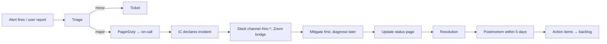

# 12 — Observability & SRE

Tài liệu này mô tả cách OmniLingo Academy đo sức khoẻ hệ thống, định nghĩa SLO, xử lý sự cố, và vận hành on-call — những việc mà "code work on laptop" không tự động đảm bảo ở production.

## 1. Triết lý

Ba nguyên tắc:

1. **Observable-by-default**: mọi service emit metric, log có traceId, structured log mặc định. Không ai thêm observability "sau khi bug xảy ra".
2. **SLO > uptime**: đo trải nghiệm user (user-centric SLI) chứ không phải máy còn sống. "Service lên nhưng login 10s" = down về mặt user.
3. **Error budget driven**: khi còn budget, release nhanh; khi hết, freeze feature, focus reliability. Cân bằng velocity vs stability bằng con số, không cảm tính.

## 2. Three pillars (metrics, logs, traces)

### 2.1. Stack

| Tầng | Tool | Purpose |
|------|------|---------|
| Metrics | Prometheus + Thanos (long-term) | Time-series, alerting |
| Logs | Loki + S3 | Structured log search |
| Traces | Tempo (hoặc Grafana Cloud Tempo) | Distributed tracing |
| Visualization | Grafana | Unified dashboards |
| APM/Profiling | Pyroscope | Continuous profiling |
| Synthetic | Grafana k6 Cloud / Checkly | External probe |
| RUM | Sentry + custom | Client-side perf, error |
| Incident mgmt | PagerDuty / Incident.io | On-call, alerting |
| Status page | Statuspage.io | Public comms |

Tất cả kết nối qua **OpenTelemetry**:
- SDK OTel trong mọi service export metric/trace/log (via OTLP).
- **OTel Collector** làm hub: nhận OTLP → route metric → Prometheus, trace → Tempo, log → Loki. Dễ thay vendor sau.

### 2.2. Instrumentation quy ước

- **Metric name**: `<service>_<subsystem>_<metric>` ví dụ `srs_service_review_queue_depth`.
- **Label cardinality cap**: < 50 per metric. Tránh `user_id` label.
- **Log fields** chuẩn: `timestamp`, `level`, `service`, `version`, `traceId`, `spanId`, `userId` (hash), `requestId`, `msg`, `...`.
- **Trace span name**: `<operation>` ví dụ `srs.schedule_review`. Attribute chứa context.

### 2.3. Sampling

- **Trace**: head-based 10% production + tail-based (keep slow / errored 100%).
- **Log**: debug level không ship prod, info+ ship all. Sampling only cho high-volume event log.
- **Metric**: không sample; scrape interval 15s (service core), 60s (batch worker).

## 3. SLI / SLO / SLA

### 3.1. Terminology

- **SLI (Indicator)**: phép đo cụ thể (ví dụ: tỷ lệ request < 300ms).
- **SLO (Objective)**: mục tiêu nội bộ (SLI > 99.5%).
- **SLA (Agreement)**: cam kết với khách (B2B contract, thường lỏng hơn SLO nội bộ).

### 3.2. User-centric SLI

Không đo "CPU < 80%" vì user không quan tâm. Đo journey:

| Journey | SLI | SLO Target |
|---------|-----|-----------|
| Login | 95th-percentile response < 800ms, success > 99.9% | 99.9% / 28d |
| Load home/dashboard | p95 < 1.5s, success > 99.5% | 99.5% / 28d |
| Start lesson | p95 < 1s, success > 99.5% | 99.5% / 28d |
| Submit answer | p95 < 400ms, success > 99.9% | 99.9% / 28d |
| SRS review batch load | p95 < 600ms, success > 99.5% | 99.5% / 28d |
| Pronunciation score | p95 < 2.5s, success > 99% | 99% / 28d |
| AI tutor first token | p95 < 1.5s, success > 99% | 99% / 28d |
| AI tutor full turn | p95 < 6s, success > 99% | 99% / 28d |
| Essay grading | p95 < 30s, success > 98% | 98% / 28d |
| Payment checkout | p95 < 2s, success > 99.9% | 99.9% / 28d |
| Media streaming start | p95 TTFB < 1s | 99.5% / 28d |

### 3.3. Per-service SLO

Core: 99.9% (43 phút downtime/tháng).
Standard: 99.5% (3h 40m/tháng).
Non-critical: 99% (7h/tháng).

| Service | Target | Justification |
|---------|--------|--------------|
| identity-service | 99.95% | Không login = tê liệt |
| api-gateway / BFF | 99.95% | Entry point |
| learning-service | 99.9% | Core UX |
| srs-service | 99.9% | Core UX |
| content-service | 99.9% | Core UX |
| assessment-service | 99.9% | Cert có deadline user |
| billing-service | 99.95% | Tiền |
| payment webhook | 99.95% | Tiền + external |
| ai-tutor-service | 99% | LLM external, chấp nhận thấp hơn |
| speech-ai-service | 99% | External dependency |
| writing-ai-service | 98% | Async job, chấp nhận |
| tutor marketplace | 99.5% | Moderate criticality |
| social-service | 99% | Non-critical |
| notification-service | 99% | Best-effort |

### 3.4. Error budget

99.9% SLO / 28d → error budget 40.32 phút.

Policy:
- **Budget > 50% left**: bình thường, ship feature.
- **Budget < 50%**: focus review reliability PR, giảm feature velocity 20%.
- **Budget < 20%**: feature freeze, chỉ bug fix + reliability.
- **Budget 0**: postmortem + action items priority-0.

Budget reset mỗi 28 ngày rolling window.

### 3.5. SLA với khách

B2B contract:
- 99.9% monthly uptime core service.
- Credit-back khi miss: 10% monthly fee cho downtime > SLA, scale up.
- Exclude: maintenance window (notice 48h), force majeure.

## 4. Dashboards

### 4.1. Standard per-service dashboard

Mỗi service có dashboard template:
- **Golden signals**: traffic (RPS), error rate, latency (p50/p95/p99), saturation (CPU/mem/queue).
- **Business metrics**: DAU, session count, lesson complete, …
- **Dependency health**: latency + error của downstream call (DB, cache, other service).
- **Resource**: pod count, pod restart, HPA state.

### 4.2. Executive dashboard

"Single pane of glass" cho leadership:
- DAU / WAU / MAU.
- Paying user, MRR delta.
- Critical SLO status (green/yellow/red).
- Cost today vs baseline.
- Incident open.

### 4.3. Journey dashboard

User journey end-to-end: login → home → start lesson → finish lesson. Latency heatmap per step.

## 5. Alerting

### 5.1. Alert types

- **Page** (PagerDuty high urgency): cần hành động < 15 phút. Ví dụ: login error rate > 1% 5 phút, payment webhook fail > 5 phút, DB master down.
- **Notify** (Slack channel, low urgency): nhìn trong giờ làm việc. Ví dụ: queue depth tăng, cost anomaly.
- **Ticket** (Jira auto-create): mai làm. Ví dụ: disk sẽ đầy trong 7 ngày.

### 5.2. Alerting on symptoms, not causes

Bad: "CPU > 90%". Good: "Login latency p95 > 2s sustained 5 min".

Nguyên nhân có thể là CPU, DB, memory leak — nhưng user chỉ quan tâm symptom. On-call debug nguyên nhân sau khi mitigate.

### 5.3. Alert hygiene

- **Actionable**: mỗi alert có runbook link, chỉ rõ "làm gì ngay".
- **No noise**: nếu alert khác nửa tháng không ai action, xoá hoặc downgrade.
- **No duplication**: one page per incident, không 10 alert cùng lúc cho 1 root cause.
- **Alert review** monthly: xem top 10 noisy alert, sửa.

### 5.4. Anomaly detection

Một số SLI khó ngưỡng cố định (ví dụ traffic pattern thay đổi theo giờ). Dùng:
- Prometheus recording rule + z-score so với baseline tuần trước.
- Grafana ML forecast (nếu đủ data).
- Datadog Watchdog nếu muốn ngoài self-host (Phase 2).

## 6. Logging

### 6.1. Structure

JSON log từ mọi service:

```json
{
  "ts": "2026-04-17T05:23:11.442Z",
  "level": "info",
  "service": "learning-service",
  "version": "v1.8.3",
  "traceId": "4bf92f3577b34da6a3ce929d0e0e4736",
  "spanId": "00f067aa0ba902b7",
  "userId": "u_abc123",   // hash nếu PII-sensitive
  "requestId": "req_1a2b",
  "route": "POST /lessons/:id/submit",
  "latencyMs": 142,
  "status": 200,
  "msg": "lesson submitted",
  "lessonId": "l_jp_a1_u3_l2",
  "score": 0.82
}
```

### 6.2. Retention

- Hot (Loki 14d): query nhanh.
- Warm (Loki S3 backed 90d): query chậm hơn.
- Cold (S3 glacier 13 tháng): compliance.
- Audit log: 7 năm (S3 Object Lock, xem [09](./09-security-and-compliance.md)).

### 6.3. PII scrubbing

Logger library (shared) mask automatically field tên phổ biến (`email`, `phone`, `password`, `token`). Config per-service cho field riêng.

Không bao giờ log payload body mặc định — opt-in per route, với redaction.

## 7. Tracing

### 7.1. What to trace

- Toàn bộ inbound HTTP/gRPC request.
- DB query (pg via pg_instrument, mongo-otel).
- Cache call (Redis command).
- Outbound HTTP (external API: Stripe, LLM vendor).
- Kafka produce / consume (linked via tracestate).
- Critical internal function (LLM prompt compose, FSRS compute).

### 7.2. Use cases

- **Latency debugging**: waterfall tìm span chậm.
- **Error root-cause**: span có exception với stack.
- **Dependency map**: service graph tự vẽ từ trace (Tempo service graph).
- **User complaint**: "tôi refresh hoài không load" → support lấy `traceId` từ UI footer → pull full trace.

### 7.3. UI integration

Mobile/web app include `X-Request-Id` + `X-Trace-Id` header trong mọi request; hiển thị trace ID trong error page "Technical reference: <id>" cho user copy gửi support.

## 8. Incident management

### 8.1. Severity

| Sev | Định nghĩa | Example | Response |
|-----|-----------|---------|----------|
| **Sev1** | Full outage, security breach, data loss | Login down, payment broken for all | All-hands page, comms 15 min |
| **Sev2** | Major degradation, significant user affected | Pronunciation fail 10-30% user | On-call + domain owner, comms 30 min |
| **Sev3** | Minor degradation | One feature slow, partial region | On-call, no external comms |
| **Sev4** | Cosmetic, minor bug | Typo, minor UI glitch | Ticket, planned fix |

### 8.2. Roles

Dùng Google SRE "Incident Command System":
- **Incident Commander (IC)**: quyết định, KHÔNG hands-on debug.
- **Operations Lead (Ops)**: hands-on mitigate.
- **Communications Lead (Comms)**: update stakeholder, status page, user email.
- **Scribe**: log timeline, quyết định.
- Sev3+ có thể IC + Ops = 1 người.

### 8.3. Flow



### 8.4. Communication

- **Internal**: Slack `#incidents` broadcast; dedicated `#inc-2026-04-17-login` channel.
- **External**: status page update mỗi 30 phút tối thiểu khi Sev1/2. Email affected paid user sau khi resolve.
- **Tone**: honest, no euphemism. "We are experiencing login failures" > "users may notice intermittent issues".

### 8.5. Postmortem

Blameless culture. Mỗi Sev1/Sev2 có postmortem doc:
- Summary + impact.
- Timeline (từ scribe).
- Root cause (technical + process — 5 whys).
- What went well.
- What went poorly.
- Action items (owner + deadline, tracked Jira).
- Lessons learned.

Public postmortem cho user-visible Sev1 — build trust.

## 9. On-call

### 9.1. Rotation

- Mỗi team domain có on-call rotation (follow-the-sun dần khi team phân tán).
- **Primary** (15-min SLA) + **Secondary** (30-min, backup).
- 1 tuần per rotation, hand-off meeting thứ Hai sáng.
- Max 1 tuần/tháng per người (tránh burnout).
- Compensation: on-call pay theo country norm.

### 9.2. Expectations

- Primary phải reachable < 15 min từ laptop (VPN, SSH key ready).
- Không yêu cầu work ngoài giờ nếu không có alert.
- Sev3 alert ngoài giờ → acknowledge, handle trong giờ trừ khi escalate.
- Sev1/2 ngoài giờ → handle ngay.

### 9.3. Runbooks

Mỗi alert link runbook markdown trong `ops-repo`:
- Symptom.
- How to verify.
- Quick mitigation (restart X, scale Y, rollback Z).
- Deeper debug steps.
- Escalation contacts.

Runbook living doc — postmortem action item usually include "update/add runbook".

### 9.4. Game days

Quarterly: team chủ động inject fault (chaos engineering) để test runbook + response:
- Kill DB master.
- Kafka cluster partial outage.
- Single AZ down.
- LLM vendor 500 errors.
- Cert expiry near-miss.

Công cụ: **Chaos Mesh** (on k8s), AWS Fault Injection Simulator.

## 10. Performance testing

### 10.1. Types

- **Load test**: baseline capacity (can system handle X RPS?).
- **Stress test**: breakpoint (at what RPS system breaks?).
- **Soak test**: 24h sustained load (memory leak?).
- **Spike test**: sudden burst (marketing campaign).

### 10.2. Tooling

- **k6** (Grafana) cho HTTP/gRPC load.
- **Locust** cho scenario phức tạp Python.
- **artillery** cho websocket (AI tutor voice).

### 10.3. Environment

- Chạy trên **staging** (mirror prod, scale ~30%).
- Chạy weekly (scheduled GitHub Action).
- Alert khi regression > 10% so với baseline.
- Trước major release, full-scale load test.

### 10.4. Capacity planning

- Quarterly review: traffic trend, upcoming campaign → projected load.
- Headroom target: 2x hiện tại.
- Auto-scale verify: HPA / Karpenter scale kịp không? Load test spike để validate.

## 11. Client-side observability (RUM)

### 11.1. Web

- **Sentry** cho error tracking.
- **Web Vitals** (LCP, INP, CLS) ship tới backend qua `performance-service`.
- Custom event (button click, feature usage) → Mixpanel/PostHog.

### 11.2. Mobile

- Firebase Crashlytics hoặc Sentry Mobile.
- Startup time, frame drop rate.
- Offline mode session marking (user chuyển online → sync event).

### 11.3. Correlation

Client RUM event có `traceId` → link với backend trace. "User load home slow" → trace end-to-end từ browser tới backend DB.

## 12. Cost observability (FinOps-lite)

- Tag resource per service + env (xem [08](./08-infrastructure-and-deployment.md)).
- Daily cost Kubernetes workload: **Kubecost** / **OpenCost** → Prometheus + Grafana.
- LLM cost per feature: `llm-gateway` metric (xem [07](./07-ai-ml-services.md)).
- Alert khi daily cost > baseline * 1.3.
- Monthly review: top 5 tăng cost → action item.

## 13. Data quality observability

ML pipeline & analytics dễ "silently broken" (event schema thay đổi, event drop):
- **Great Expectations** trên dbt transformation pipeline.
- Monitor event volume delta day-over-day; alert khi drop > 20% bất thường.
- Schema registry cho Kafka topic — reject producer sai schema.

## 14. Compliance & audit reporting

- Quarterly report: uptime actual vs SLO cho B2B customer.
- SOC 2 audit artifact: access log, change log, incident log.
- GDPR data access log (ai truy cập PII) — immutable.

## 15. Maturity roadmap

| Phase | Milestone |
|-------|-----------|
| **MVP** | Basic 3 pillars, alerting core flows, on-call skeleton |
| **+6mo** | SLO formal, error budget enforce, postmortem culture |
| **+12mo** | Chaos engineering regular, full journey tracing |
| **+18mo** | Predictive alerting, capacity auto-plan, cost attribution dashboard |
| **+24mo** | Self-healing workflows (auto-rollback, auto-scale), SRE-product partnership maturity |

---

**Tham chiếu**: [04 — Microservices](./04-microservices-breakdown.md) (service list) · [07 — AI/ML](./07-ai-ml-services.md) (LLM cost) · [08 — Infrastructure](./08-infrastructure-and-deployment.md) (deployment, K8s) · [09 — Security](./09-security-and-compliance.md) (audit log, incident response security track)
