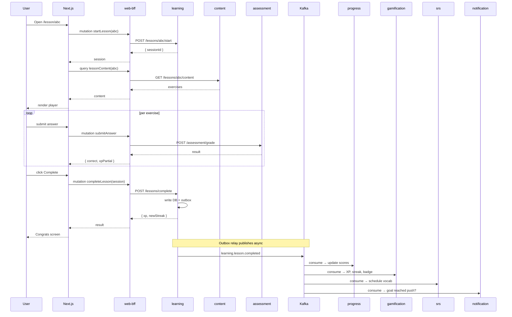

# Flow 03 — Dashboard & Learn Lesson

> Dashboard aggregation (1 query → nhiều service parallel), Track browsing, Unit/Lesson lifecycle, Exercise grading, Lesson completion fan-out.
>
> **Services**: `learning`, `content`, `assessment`, `progress`, `gamification`, `srs`, `vocabulary`, `entitlement`.

---

## 1. Dashboard load

### Trigger
- User login, vào `/dashboard`.

### Sequence

```
User ─► /dashboard (Next.js RSC)
         │
         ├─ Server-side fetch: gql(DASHBOARD_QUERY, {}, accessToken)
         │
         └─ BFF resolver `dashboard`:
              ┌───── parallel via DataLoader ─────┐
              │  identity.getMe()                  │
              │  progress.getSummary()             │
              │  progress.getWeekly(days: 7)       │
              │  entitlement.getMyEntitlements()   │
              │  learning.getMyTracks()            │
              │  learning.getTodayMission()        │
              │  vocabulary.getMyDecks()           │
              │  srs.getDueCount()                 │
              │  gamification.getStreak()          │
              └────────────────────────────────────┘
                         │
                         ▼ Tổng hợp vào 1 object `Dashboard`
              → trả về Next.js (SSR render)
```

### GraphQL query (đã có + cần bổ sung)

```graphql
query Dashboard {
  dashboard {
    user { id, displayName, avatarUrl, level }     # identity
    progress {
      streak, totalXp, minutesLearnedToday,
      wordsMastered, dailyGoalMinutes
    }                                              # progress
    weeklyProgress { date, xp, minutes }           # progress
    entitlement {
      planTier, aiTutorDaily, mockTestMonthly,
      renewsAt, trialEndsAt
    }                                              # entitlement
    myTracks {
      id, title, language, level,
      progressPct, currentUnit { id, title }
    }                                              # learning
    todayMission {                                 # 🔴 cần thêm
      lesson { id, title, estimatedMinutes }
      xpToGoal
    }
    myDecks { id, name, cardCount, dueCount }      # vocabulary
    srsDueCount                                    # 🔴 cần thêm (srs-service)
    streak {                                       # gamification
      current, longest, frozenDays, atRisk
    }
  }
}
```

### Caching
- BFF cache: `progress.summary` TTL 60s, `weeklyProgress` TTL 5m, `myTracks` TTL 30s.
- Invalidate khi:
  - `learning.lesson.completed` → invalidate `todayMission`, `myTracks`, `progress.summary`.
  - `srs.review.completed` → invalidate `srsDueCount`, `progress.summary`.

---

## 2. Browse tracks & units

### Page `/learn`

```
Load: query myTracks { ... }
  → render grid tracks card

Click track card → mở modal hoặc navigate /learn/[trackId]
  → query track(id) { units { id, title, lessonCount, completedCount } }
```

### Page `/learn/[trackId]`

```
query track(trackId) {
  ...
  units {
    id, title, orderIndex, unlocked,
    lessons {
      id, title, estimatedMinutes, xp,
      completed, stars
    }
  }
}
```

BFF composes:
- `learning.getTrack(trackId)` — user enrollment, progress pct
- `content.getUnits(trackId)` + `content.getLessons(unitId[])` — lesson metadata

### Enroll track (nếu chưa)

```
Click "Bắt đầu track"
  ├─ mutation enrollTrack(trackId)
  │    BFF → learning-service:
  │         1. INSERT user_tracks (user_id, track_id, current_unit_id)
  │         2. Publish learning.track.enrolled
  │         → { trackId, firstUnitId }
  │
  ├─ Kafka: progress consume → initialize track_progress record
  │
  └─ UI: navigate đến lesson đầu của unit đầu.
```

---

## 3. Lesson lifecycle

### 3.1. Start lesson

### Trigger
- Click lesson card trong `/learn/[trackId]` hoặc "Continue" trên dashboard.

### Sequence

```
User ─► /lesson/[lessonId] (RSC)
         │
         ├─ Server-side: mutation startLesson(lessonId)
         │    BFF → learning-service:
         │      1. Check entitlement (nếu lesson premium)
         │      2. INSERT lesson_sessions (id, user_id, lesson_id, started_at)
         │      3. Publish learning.lesson.started
         │      → { sessionId, lesson: { id, title, xp } }
         │
         ├─ parallel: query lessonContent(lessonId)
         │    BFF → content-service:
         │      → { exercises: [...], vocabulary: [...], audioAssets: [...] }
         │
         └─ Render lesson player với exercises
```

### 3.2. Submit answer (per exercise)

```
User trả lời 1 câu → client event
  ├─ Client: optimistic check (chỉ feedback UI, không authoritative)
  │
  ├─ mutation submitAnswer(sessionId, exerciseId, answer)
  │    BFF → assessment-service:
  │      1. Fetch exercise answer key (content-service)
  │      2. Grade (exact match / fuzzy / speech-ai cho voice)
  │      3. INSERT exercise_attempts (session_id, exercise_id, answer, correct, time_ms)
  │      4. Compute partial XP (base_xp × correct × streak_in_lesson)
  │      5. → {
  │           correct: true/false,
  │           correctAnswer: "...",
  │           explanation: "...",
  │           xpEarnedPartial: 5
  │         }
  │
  └─ UI: animate correct/incorrect, progress bar tăng, next card
```

**Không** emit Kafka event per-answer (quá noisy). Chỉ emit khi complete lesson.

### 3.3. Complete lesson

```
User hoàn thành exercise cuối + click "Hoàn thành"
  ├─ mutation completeLesson(sessionId)
  │    BFF → learning-service:
  │      1. SELECT exercise_attempts WHERE session_id=?
  │      2. Compute final score, total XP, accuracy
  │      3. UPDATE lesson_sessions SET completed_at=NOW(), score=?
  │      4. UPDATE user_lessons SET completed=true, stars=... (idempotent)
  │      5. UPDATE user_tracks SET current_unit_id=... (nếu unit xong)
  │      6. INSERT outbox: learning.lesson.completed {
  │           userId, lessonId, sessionId, score, accuracy,
  │           xpEarned, durationMs, skillTags: ["vocab", "grammar"],
  │           vocabularyLearned: [cardId1, cardId2, ...]
  │         }
  │      7. COMMIT TX
  │      → {
  │           xpEarned, newStreak, newBadges: [],
  │           nextLessonId, unitCompleted: bool
  │         }
  │
  └─ UI: "Congrats" modal — XP animation, badges unlocked, "Next lesson"
```

### 3.4. Kafka fan-out sau `learning.lesson.completed`

| Consumer | Hành động |
|----------|-----------|
| **progress** | Update `daily_activity(date, xp, minutes, lessons)`; update `skill_scores` per tag; update `minutes_learned_total`; nếu >= daily_goal → publish `progress.daily_goal.reached` |
| **gamification** | Add XP; check streak (nếu là lesson đầu của ngày → streak++); check badges (first_lesson, 10_lessons_streak, perfect_score); nếu level up → publish `gamification.level.up` |
| **srs** | Parse `vocabularyLearned[]`; INSERT initial srs_items (state=new, due_at=NOW()+1h) |
| **notification** | Nếu lần đầu trong ngày hoàn thành daily goal → send push "🎯 Daily goal reached!" |
| **content** | (Optional) Update lesson stats (completion rate, avg score) |

### 3.5. Sequence diagram (mermaid)



---

## 4. BFF Schema additions

```graphql
# Queries cần thêm
extend type Query {
  track(id: ID!): TrackDetail!
  units(trackId: ID!): [Unit!]!
  lessonContent(lessonId: ID!): LessonContent!
  todayMission: TodayMission
  srsDueCount: Int!
}

type TrackDetail {
  id: ID!
  title: String!
  language: String!
  level: String!
  description: String!
  progressPct: Float!
  units: [Unit!]!
}

type Unit {
  id: ID!
  title: String!
  orderIndex: Int!
  unlocked: Boolean!
  lessonCount: Int!
  completedCount: Int!
  lessons: [LessonCard!]!
}

type LessonCard {
  id: ID!
  title: String!
  estimatedMinutes: Int!
  xp: Int!
  completed: Boolean!
  stars: Int
}

type LessonContent {
  id: ID!
  title: String!
  exercises: [Exercise!]!
  vocabulary: [VocabItem!]!
}

type Exercise {
  id: ID!
  type: ExerciseType!
  prompt: String!
  options: [String!]
  audioUrl: String
  imageUrl: String
}

enum ExerciseType {
  MCQ TYPING MATCHING LISTENING_DICT LISTENING_SELECT
  SPEAKING FILL_BLANK SENTENCE_ORDER
}

type TodayMission {
  lesson: LessonCard!
  xpToGoal: Int!
  streakAtRisk: Boolean!
}

extend type Mutation {
  enrollTrack(trackId: ID!): EnrollResult!
  startLesson(lessonId: ID!): StartLessonResult!
  submitAnswer(sessionId: String!, exerciseId: ID!, answer: String!): AnswerResult!
  completeLesson(sessionId: String!): LessonResult!
  abandonLesson(sessionId: String!): Boolean!
}

type AnswerResult {
  correct: Boolean!
  correctAnswer: String
  explanation: String
  xpPartial: Int!
}

type LessonResult {
  xpEarned: Int!
  accuracy: Float!
  newStreak: Int!
  newBadges: [Achievement!]!
  nextLessonId: ID
  unitCompleted: Boolean!
  trackCompleted: Boolean!
}
```

---

## 5. Idempotency

- `startLesson(lessonId)` lần 2 khi đã có session active → return same `sessionId`.
- `completeLesson(sessionId)` lần 2 → return cached result, KHÔNG emit event lần 2 (check `completed_at IS NULL` trước UPDATE).
- `submitAnswer(sessionId, exerciseId)` lần 2 → chỉ lưu attempt đầu tiên, trả về grading của attempt đầu.

---

## 6. Edge cases

| Case | Xử lý |
|------|-------|
| User đóng browser giữa lesson | Session giữ nguyên 30 phút; resume sẽ load lại exercises đã submit |
| Mất mạng khi submit answer | Client queue local, retry khi online |
| Lesson premium, user downgrade | Entitlement check fail trước khi start → 403 + CTA upgrade |
| 2 device cùng mở lesson | Mỗi device có session riêng nhưng ghi vào same `user_lessons` → attempt đầu thắng |
| Complete lesson với accuracy < 50% | Vẫn cho hoàn thành, nhưng stars=0 và không unlock next unit |

---

## 7. Metrics

- Lesson completion rate
- Avg time per lesson
- Drop-off rate per exercise index
- Answer accuracy distribution (để calibrate độ khó)
